# Results -- Strict Motif-Core Filter

## Motivation and filter definition

Isoforms are included only if at least one VSP has its start or end position
**within** `[first_motif_beta_start, last_motif_alpha_end]` -- the annotated
ba motif core of the TIM barrel. VSPs that merely span the entire core
(starting before and ending after) are excluded: they delete the whole barrel
rather than splicing at a specific structural position. The null distribution
for Analyses 1-4 is computed from residue positions within the same core
interval, using 4 categories (b-strand, a-helix, α→β loop, β→α loop).
Flanking positions outside the annotated motifs are excluded from both
numerator and denominator.

---

## Dataset summary

> **Script:** `scripts/run_alternative_analysis.py`

| | Count |
|---|---|
| Total proteins in analysis (canonical + isoforms) | **314** |
| &ensp;— canonical proteins | 191 |
| &ensp;— AS isoforms (strict) | **123** |
| Canonical proteins with ≥ 1 motif-core AS isoform (strict) | **76** |
| Canonical proteins with no motif-core AS isoform (strict) | 115 |
| Total AS isoforms (strict) | **123** |

### Motif-count distribution

| $K_p$ | Domain instances |
|---|---|
| 1 | 2 |
| 2 | 7 |
| 3 | 1 |
| 4 | 5 |
| 5 | 2 |
| 6 | 17 |
| 7 | 27 |
| 8 | 140 |

### AS-isoform count per canonical protein (strict)

| Isoforms per canonical | Proteins |
|---|---|
| 0 | 115 |
| 1 | 47 |
| 2 | 17 |
| 3 | 8 |
| 4 | 3 |
| 6 | 1 |

### Ensembl transcript coverage

186 of 191 canonical proteins are matched to an Ensembl transcript and are
used in Analyses 1-4. 5 canonical proteins lack a matched transcript and are
excluded from junction-based analyses.

### Motif-core null

The following 4-category length-weighted null is used in Analyses 1-4.
Computed over `[first_beta_start, last_alpha_end]` of all 186
Ensembl-matched canonical proteins.

| Element | $\pi_t^0$ |
|---|---|
| b-strand    | 0.155 |
| a-helix     | 0.336 |
| α→β loop | 0.248 |
| β→α loop | 0.261 |

---

## Analysis 1 -- Canonical splice-junction enrichment (motif-core null)

> **Script:** `scripts/run_alternative_analysis.py`

**Dataset:** 186 Ensembl-matched canonical proteins with >= 1 core junction.

**Method:** Junction-count-weighted null restricted to junctions within
`[first_beta_start, last_alpha_end]`. Flanking junctions are excluded from
both null denominator and observed counts. 4 categories.

**Results** ($N = 1087$ core junctions, global $\chi^2(3) = 17.58$, $p = 0.0005$):

| Element | $N_t$ | $f_t$ | $\pi_t^0$ | $\rho_t$ | Raw $p$ | BH $p$ | Sig |
|---|---|---|---|---|---|---|---|
| b-strand    | 191 | 0.176 | 0.158 | 1.111 | 0.1466 | 0.1955 | ns  |
| a-helix     | 400 | 0.368 | 0.339 | 1.085 | 0.1030 | 0.1955 | ns  |
| α→β loop | 273 | 0.251 | 0.243 | 1.034 | 0.5765 | 0.5765 | ns  |
| β→α loop | 223 | 0.205 | 0.260 | **0.790** | 0.0004 | **0.0016** | **  |

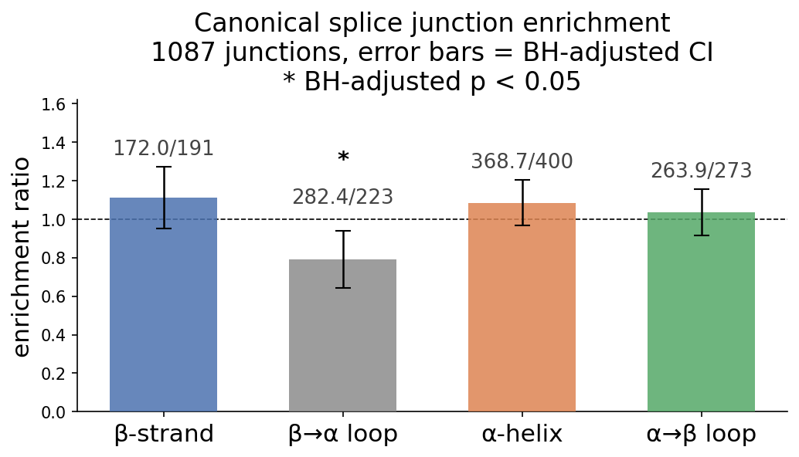

### Conclusion

Loop depletion is the sole significant signal ($\rho = 0.790$, BH $p = 0.002$).
The qualitative result is unchanged from the primary analysis: canonical splice
junctions avoid the β→α loop element of TIM barrel repeats.

---

## Analysis 2 -- Motif-specific junction enrichment, $K_p=8$ (motif-core null)

> **Script:** `scripts/run_alternative_analysis.py`

**Dataset:** 129 $K_p=8$ canonical proteins with >= 1 Ensembl core junction.

**Method:** 31-category motif-specific null (b/loop/a x k=1..8; inter x k=1..7),
restricted to junctions within `[first_beta_start, last_alpha_end]`.

**Results** ($N = 820$ core junctions, global $\chi^2(30) = 41.47$, $p = 0.079$):

No individual category survives BH correction at 5%. The global test is marginal
and the signal is distributed rather than concentrated in any single position.

Full per-category table:

| Category | $N_t$ | $\pi_t^0$ | $f_t$ | $\rho_t$ | BH $p$ | Sig |
|---|---|---|---|---|---|---|
| b k=1 | 15 | 0.0192 | 0.0183 | 0.951 | 0.9865 | ns |
| loop k=1 | 34 | 0.0402 | 0.0415 | 1.031 | 0.9865 | ns |
| a k=1 | 34 | 0.0413 | 0.0415 | 1.004 | 0.9865 | ns |
| b k=2 | 26 | 0.0209 | 0.0317 | 1.518 | 0.3042 | ns |
| loop k=2 | 14 | 0.0291 | 0.0171 | 0.586 | 0.3042 | ns |
| a k=2 | 31 | 0.0422 | 0.0378 | 0.896 | 0.8815 | ns |
| b k=3 | 24 | 0.0218 | 0.0293 | 1.340 | 0.4728 | ns |
| loop k=3 | 19 | 0.0259 | 0.0232 | 0.894 | 0.9706 | ns |
| a k=3 | 35 | 0.0482 | 0.0427 | 0.886 | 0.8649 | ns |
| b k=4 | 13 | 0.0206 | 0.0159 | 0.771 | 0.7155 | ns |
| loop k=4 | 22 | 0.0410 | 0.0268 | 0.655 | 0.3042 | ns |
| a k=4 | 52 | 0.0470 | 0.0634 | 1.350 | 0.3042 | ns |
| b k=5 | 19 | 0.0211 | 0.0232 | 1.096 | 0.9865 | ns |
| loop k=5 | 14 | 0.0242 | 0.0171 | 0.707 | 0.4951 | ns |
| a k=5 | 40 | 0.0392 | 0.0488 | 1.243 | 0.4728 | ns |
| b k=6 | 17 | 0.0206 | 0.0207 | 1.008 | 0.9865 | ns |
| loop k=6 | 12 | 0.0256 | 0.0146 | 0.571 | 0.3042 | ns |
| a k=6 | 36 | 0.0434 | 0.0439 | 1.012 | 0.9865 | ns |
| b k=7 | 16 | 0.0194 | 0.0195 | 1.004 | 0.9865 | ns |
| loop k=7 | 23 | 0.0286 | 0.0280 | 0.981 | 0.9865 | ns |
| a k=7 | 42 | 0.0400 | 0.0512 | 1.281 | 0.4728 | ns |
| b k=8 | 15 | 0.0172 | 0.0183 | 1.063 | 0.9865 | ns |
| loop k=8 | 16 | 0.0276 | 0.0195 | 0.707 | 0.4728 | ns |
| a k=8 | 43 | 0.0454 | 0.0524 | 1.155 | 0.7155 | ns |
| inter k=1 | 24 | 0.0407 | 0.0293 | 0.719 | 0.4728 | ns |
| inter k=2 | 37 | 0.0359 | 0.0451 | 1.256 | 0.4728 | ns |
| inter k=3 | 27 | 0.0292 | 0.0329 | 1.128 | 0.8815 | ns |
| inter k=4 | 35 | 0.0371 | 0.0427 | 1.152 | 0.7800 | ns |
| inter k=5 | 35 | 0.0416 | 0.0427 | 1.026 | 0.9865 | ns |
| inter k=6 | 22 | 0.0248 | 0.0268 | 1.082 | 0.9865 | ns |
| inter k=7 | 28 | 0.0410 | 0.0341 | 0.833 | 0.7155 | ns |

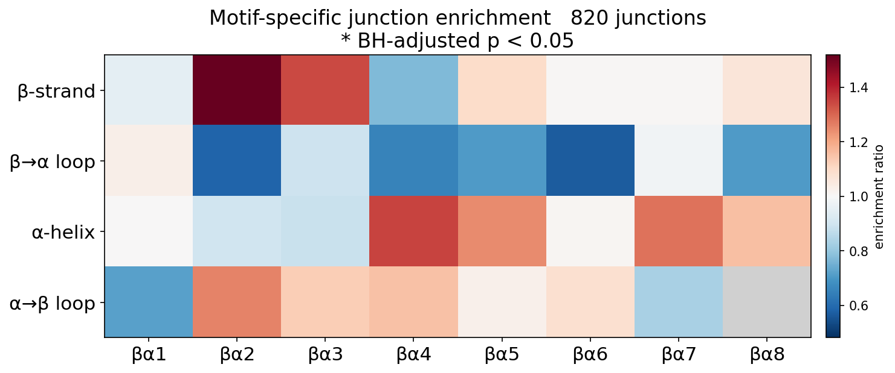

---

## Analysis 3 -- Transcript-derived AS boundary enrichment

> **Script:** `scripts/run_alternative_analysis.py`

**Dataset:** 186 Ensembl-matched canonical proteins; 123 strict isoforms;
**158 AS boundary pairs** (diverge point $D_{\text{seq}}$ to resync point
$R_{\text{can}}-1$).

### Boundary-pair classification

| Type | Description | Count |
|---|---|---|
| Contained | Both start and end within core | 60 |
| Enters core | Start outside core, end inside core | 54 |
| Exits core | Start inside core, end outside core | 33 |
| Spans core | Both outside core | 11 |

---

### Part A -- Motif-core enrichment (positions within core only)

**Null:** 4-category motif-core null (b = 0.155, a = 0.336, inter = 0.248, loop = 0.261).

**Transcript start positions ($D_{\text{seq}}$, $N = 93$, global $\chi^2(3) = 15.18$, $p = 0.0017$):**

| Element | $N_t$ | $f_t$ | $\pi_t^0$ | $\rho_t$ | Raw $p$ | BH $p$ | Sig |
|---|---|---|---|---|---|---|---|
| b-strand    | 26 | 0.280 | 0.155 | **1.799** | 0.0024 | **0.0095** | **  |
| a-helix     | 35 | 0.376 | 0.336 | 1.119 | 0.5052 | 0.5052 | ns  |
| α→β loop | 13 | 0.140 | 0.248 | 0.565 | 0.0367 | 0.0735 | ns  |
| β→α loop | 19 | 0.204 | 0.261 | 0.783 | 0.2861 | 0.3815 | ns  |

**Transcript end positions ($R_{\text{can}}-1$, $N = 114$, global $\chi^2(3) = 10.13$, $p = 0.018$):**

| Element | $N_t$ | $f_t$ | $\pi_t^0$ | $\rho_t$ | Raw $p$ | BH $p$ | Sig |
|---|---|---|---|---|---|---|---|
| b-strand    | 19 | 0.167 | 0.155 | 1.073 | 0.7599 | 0.7599 | ns  |
| a-helix     | 43 | 0.377 | 0.336 | 1.122 | 0.4512 | 0.6016 | ns  |
| α→β loop | 14 | 0.123 | 0.248 | **0.496** | 0.0074 | **0.0297** | *   |
| β→α loop | 38 | 0.333 | 0.261 | 1.278 | 0.1293 | 0.2587 | ns  |

**Pooled (start + end combined, $N = 207$):**

| Element | $N_t$ | $f_t$ | $\pi_t^0$ | $\rho_t$ | BH $p$ | Sig |
|---|---|---|---|---|---|---|
| b-strand    | 45 | 0.217 | 0.155 | **1.399** | **0.0472** | *  |
| a-helix     | 78 | 0.377 | 0.336 | 1.121 | 0.4194 | ns |
| α→β loop | 27 | 0.130 | 0.248 | **0.527** | **0.0028** | ** |
| β→α loop | 57 | 0.275 | 0.261 | 1.056 | 0.6814 | ns |

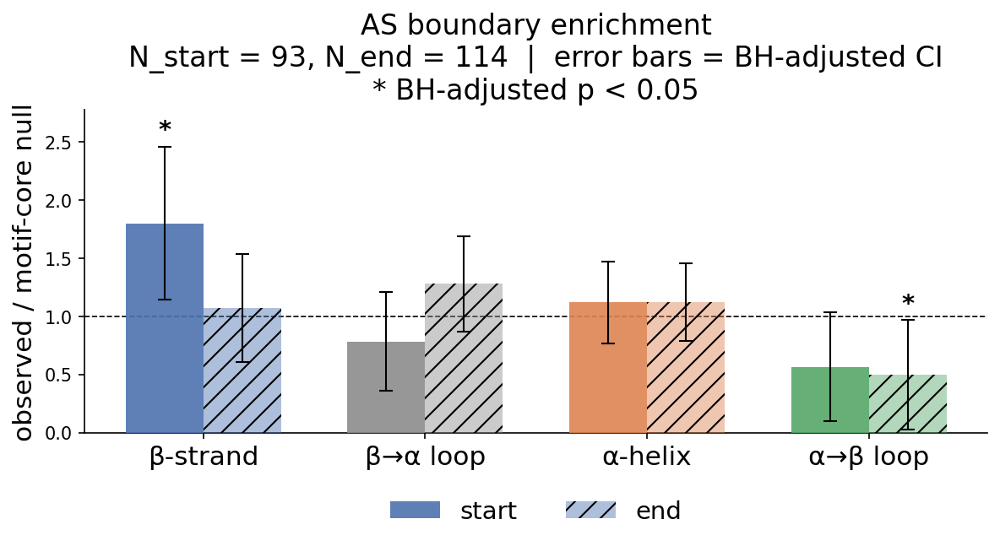

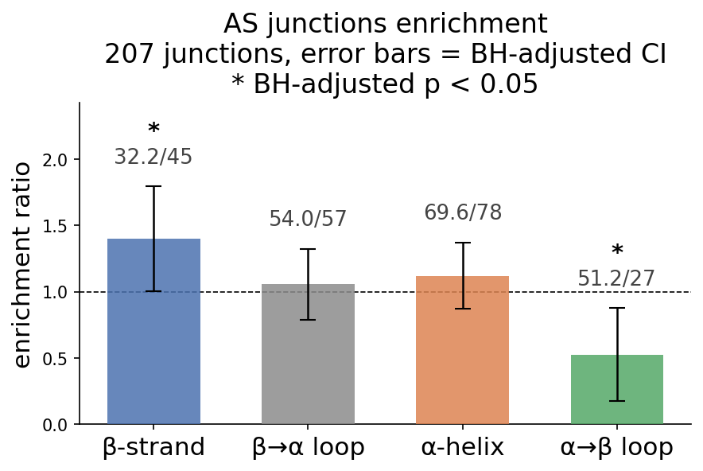

---

### Part B -- Full-domain view (all 158 boundary pairs)

Compared against the full-domain length-weighted null (5 categories including flanking).

**Transcript start positions ($D_{\text{seq}}$, $N = 158$, global $\chi^2(4) = 72.58$, $p < 0.0001$):**

| Element | $N_t$ | $f_t$ | $\pi_t^0$ | $\rho_t$ | Raw $p$ | BH $p$ | Sig |
|---|---|---|---|---|---|---|---|
| b-strand    | 26 | 0.165 | 0.128 | 1.282 | 0.2038 | 0.2038 | ns  |
| a-helix     | 35 | 0.222 | 0.278 | 0.798 | 0.1812 | 0.2038 | ns  |
| α→β loop | 13 | 0.082 | 0.204 | **0.402** | 0.0007 | **0.0017** | **  |
| β→α loop | 19 | 0.120 | 0.215 | **0.558** | 0.0100 | **0.0166** | *   |
| Flanking    | 65 | 0.411 | 0.174 | **2.361** | <0.0001 | **<0.0001** | *** |

**Transcript end positions ($R_{\text{can}}-1$, $N = 158$, global $\chi^2(4) = 20.79$, $p = 0.0003$):**

| Element | $N_t$ | $f_t$ | $\pi_t^0$ | $\rho_t$ | Raw $p$ | BH $p$ | Sig |
|---|---|---|---|---|---|---|---|
| b-strand    | 19 | 0.120 | 0.128 | 0.937 | 0.7766 | 0.8972 | ns  |
| a-helix     | 43 | 0.272 | 0.278 | 0.980 | 0.8972 | 0.8972 | ns  |
| α→β loop | 14 | 0.089 | 0.204 | **0.433** | 0.0013 | **0.0042** | **  |
| β→α loop | 38 | 0.241 | 0.215 | 1.117 | 0.4965 | 0.8275 | ns  |
| Flanking    | 44 | 0.278 | 0.174 | **1.598** | 0.0017 | **0.0042** | **  |

**Pooled (start + end combined, $N = 316$):**

| Element | $N_t$ | $f_t$ | $\pi_t^0$ | $\rho_t$ | BH $p$ | Sig |
|---|---|---|---|---|---|---|
| b-strand    | 45 | 0.142 | 0.128 | 1.110 | 0.4852 | ns  |
| a-helix     | 78 | 0.247 | 0.278 | 0.889 | 0.3748 | ns  |
| α→β loop | 27 | 0.085 | 0.204 | **0.418** | **<0.0001** | *** |
| β→α loop | 57 | 0.180 | 0.215 | 0.837 | 0.2997 | ns  |
| Flanking    | 109 | 0.345 | 0.174 | **1.980** | **<0.0001** | *** |

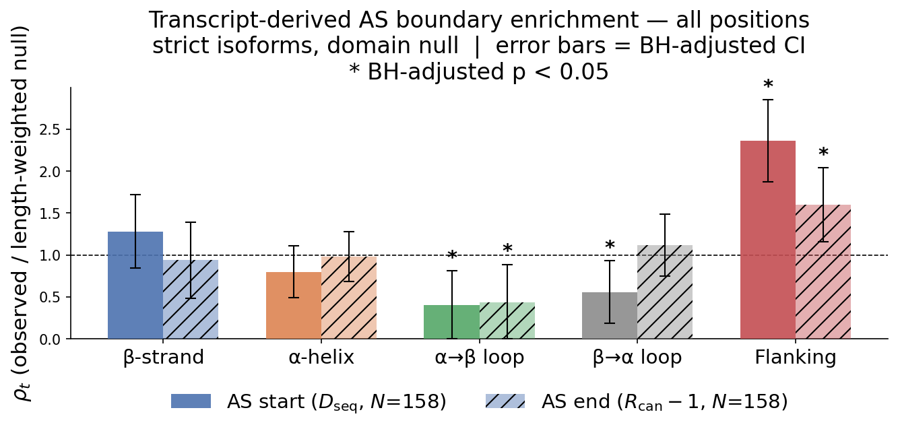

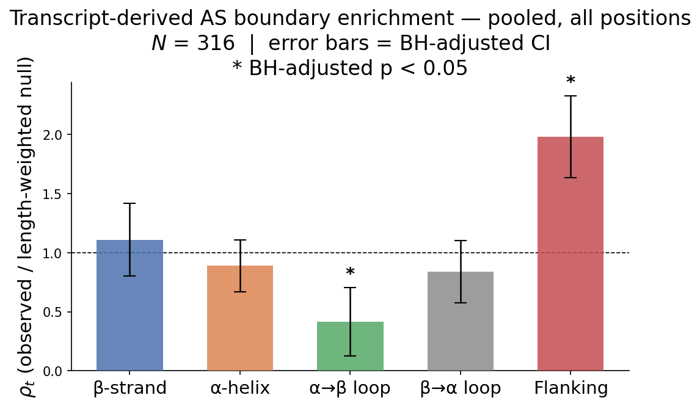

### Conclusion

Both views agree on the core result. **Start positions are strongly non-random**
($\chi^2(4) = 72.58$, $p < 0.0001$ full-domain; $\chi^2(3) = 15.18$,
$p = 0.0017$ core-only): AS regions tend to start in flanking tails
($\rho = 2.361$) and b-strand positions within the core ($\rho = 1.799$).
α→β loop positions are consistently avoided ($\rho \approx 0.40-0.57$).
**End positions show structured depletion of α→β loops** ($\rho = 0.433$,
BH $p = 0.004$) and flanking enrichment ($\rho = 1.598$, BH $p = 0.004$)
in the full-domain view, while the core-only test is marginal
($\chi^2(3) = 10.13$, $p = 0.018$, no element survives BH correction).

---

### Part C -- AS boundaries vs. canonical junction null

**Null:** Empirical frequency of canonical splice junctions across motif-core elements (from Analysis 1): β-strand = 0.176, α-helix = 0.368, α→β loop = 0.251, β→α loop = 0.205.

This tests whether AS boundary placement differs from where canonical splice junctions already tend to land, controlling for pre-existing splice-site preferences.

**Transcript start positions ($D_{\text{seq}}$, $N = 93$, global $\chi^2(3) = 10.32$, $p = 0.016$):**

| Element | $N_t$ | $f_t$ | $\pi_t^0$ | $\rho_t$ | Raw $p$ | BH $p$ | Sig |
|---|---|---|---|---|---|---|---|
| b-strand    | 26 | 0.280 | 0.176 | 1.591 | 0.0169 | 0.0642 | ns  |
| a-helix     | 35 | 0.376 | 0.368 | 1.023 | 0.8943 | 0.9855 | ns  |
| α→β loop | 13 | 0.140 | 0.251 | 0.557 | 0.0321 | 0.0642 | ns  |
| β→α loop | 19 | 0.204 | 0.205 | 0.996 | 0.9855 | 0.9855 | ns  |

**Transcript end positions ($R_{\text{can}}-1$, $N = 114$, global $\chi^2(3) = 16.69$, $p = 0.0008$):**

| Element | $N_t$ | $f_t$ | $\pi_t^0$ | $\rho_t$ | Raw $p$ | BH $p$ | Sig |
|---|---|---|---|---|---|---|---|
| b-strand    | 19 | 0.167 | 0.176 | 0.949 | 0.8178 | 0.8713 | ns  |
| a-helix     | 43 | 0.377 | 0.368 | 1.025 | 0.8713 | 0.8713 | ns  |
| α→β loop | 14 | 0.123 | 0.251 | **0.489** | 0.0062 | **0.0125** | *   |
| β→α loop | 38 | 0.333 | 0.205 | **1.625** | 0.0025 | **0.0101** | *   |

**Pooled (start + end combined, $N = 207$):**

| Element | $N_t$ | $f_t$ | $\pi_t^0$ | $\rho_t$ | BH $p$ | Sig |
|---|---|---|---|---|---|---|
| b-strand    | 45 | 0.217 | 0.176 | 1.237 | 0.2034 | ns |
| a-helix     | 78 | 0.377 | 0.368 | 1.024 | 0.8342 | ns |
| α→β loop | 27 | 0.130 | 0.251 | **0.519** | **0.0021** | ** |
| β→α loop | 57 | 0.275 | 0.205 | 1.342 | 0.0515 | ns |

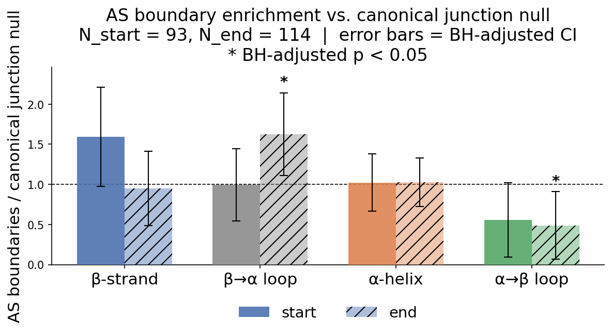

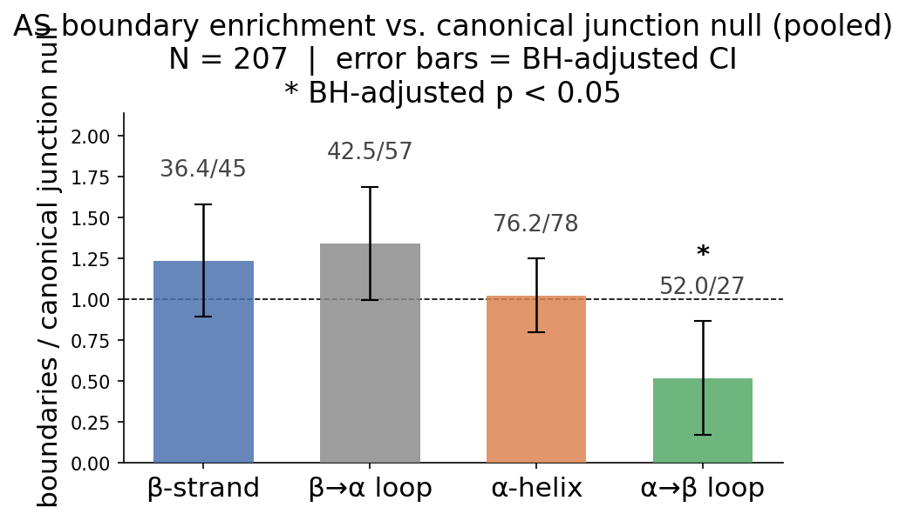

#### Interpretation

Compared to the residue null (Part A), switching to the canonical junction null reveals three things:

1. **β-strand enrichment at start positions is not independently AS-specific** ($\rho$ drops from 1.799 to 1.591, ns after BH correction). Canonical junctions already slightly prefer β-strands over the residue baseline, so the enrichment seen in Part A is not unique to AS boundaries.

2. **β-strand enrichment at end positions vanishes** ($\rho = 0.949$, ns). End-point β-strand signal in Part A was entirely an artefact of canonical splice-site preferences.

3. **α→β loop avoidance at end positions is genuinely AS-specific** ($\rho = 0.489$, BH $p = 0.013$): canonical junctions do not over-avoid α→β loops, so the depletion at AS end points is a real structural constraint. **β→α loop enrichment also emerges at end positions** ($\rho = 1.625$, BH $p = 0.010$): canonical junctions actively avoid β→α loops, but AS end points do not share that avoidance.

---

## Analysis 4 -- VSP boundary placement in structural elements (motif-core null)

> **Script:** `scripts/run_alternative_analysis.py`
>
> **Note:** This analysis uses UniProt VSP annotations as the source of splice boundaries, whereas Analysis 3 derives them computationally from transcript sequence alignment. Because both approaches recover the boundaries of the same alternatively spliced regions, this analysis serves as a cross-validation of Analysis 3. The near-identical results (β-strand enrichment, α→β loop depletion) confirm that the signal is robust to the choice of boundary-calling method.

**Dataset:** **157 VSP spans** across 71 canonical proteins (Ensembl-matched,
strict, diverge-checked).

**Note:** Under the motif-core null, only boundary positions within
`[first_beta_start, last_alpha_end]` are counted. Of 157 VSP spans:
107 start positions and 117 end positions fall within the motif core.

### Results

**VSP start positions** ($N = 107$, global $\chi^2(3) = 9.92$, $p = 0.019$):

| Element | $N_t$ | $f_t$ | $\pi_t^0$ | $\rho_t$ | Raw $p$ | BH $p$ | Sig |
|---|---|---|---|---|---|---|---|
| b-strand    | 25 | 0.234 | 0.155 | 1.504 | 0.0400 | 0.0831 | ns  |
| a-helix     | 42 | 0.393 | 0.336 | 1.167 | 0.3157 | 0.4209 | ns  |
| α→β loop | 16 | 0.150 | 0.248 | 0.604 | 0.0416 | 0.0831 | ns  |
| β→α loop | 24 | 0.224 | 0.261 | 0.860 | 0.4598 | 0.4598 | ns  |

**VSP end positions** ($N = 117$, global $\chi^2(3) = 10.92$, $p = 0.012$):

| Element | $N_t$ | $f_t$ | $\pi_t^0$ | $\rho_t$ | Raw $p$ | BH $p$ | Sig |
|---|---|---|---|---|---|---|---|
| b-strand    | 24 | 0.205 | 0.155 | 1.320 | 0.1723 | 0.3445 | ns  |
| a-helix     | 43 | 0.368 | 0.336 | 1.093 | 0.5600 | 0.5600 | ns  |
| α→β loop | 14 | 0.120 | 0.248 | **0.483** | 0.0054 | **0.0217** | *   |
| β→α loop | 36 | 0.308 | 0.261 | 1.180 | 0.3205 | 0.4273 | ns  |

**Pooled (start + end combined, $N = 224$):**

| Element | $N_t$ | $f_t$ | $\pi_t^0$ | $\rho_t$ | BH $p$ | Sig |
|---|---|---|---|---|---|---|
| b-strand    | 49 | 0.219 | 0.155 | **1.408** | **0.0323** | *  |
| a-helix     | 85 | 0.379 | 0.336 | 1.128 | 0.3533 | ns |
| α→β loop | 30 | 0.134 | 0.248 | **0.541** | **0.0025** | ** |
| β→α loop | 60 | 0.268 | 0.261 | 1.027 | 0.8359 | ns |

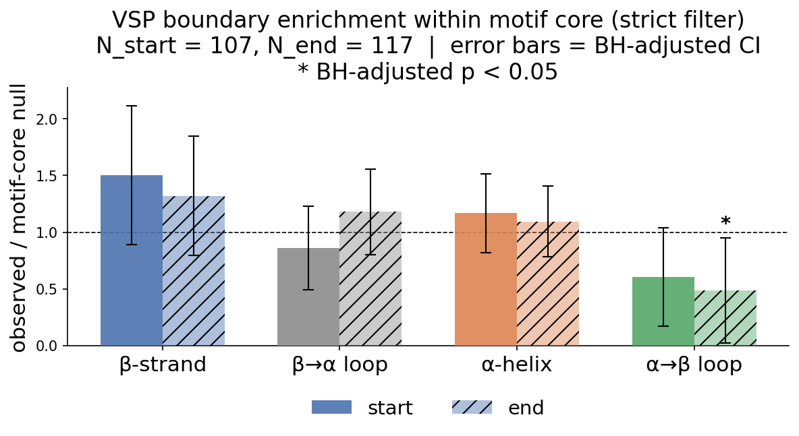

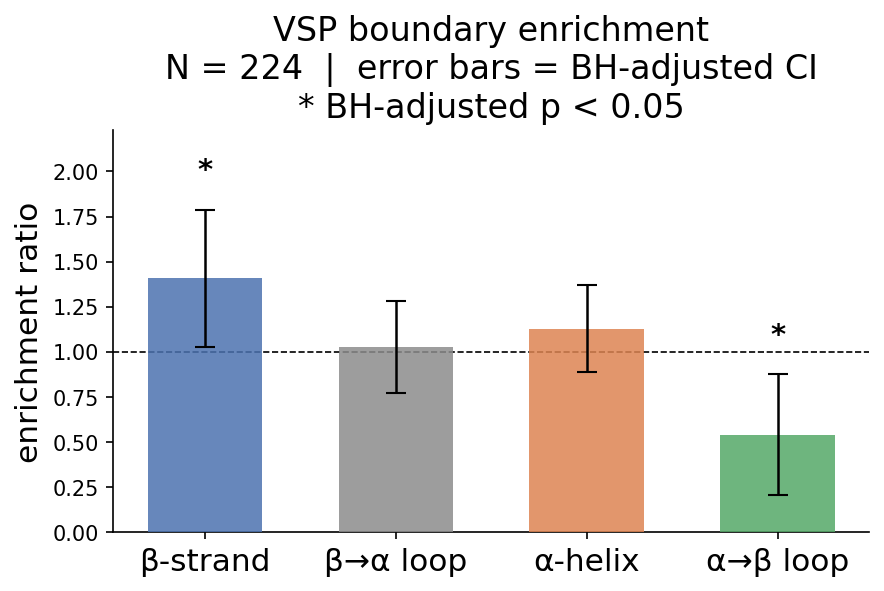

### Conclusion

In the end-position test, α→β loop depletion reaches individual significance
($\rho = 0.483$, BH $p = 0.022$). The pooled test confirms both b-strand
enrichment ($\rho = 1.408$, BH $p = 0.032$) and α→β loop depletion
($\rho = 0.541$, BH $p = 0.003$). This confirms that VSP boundaries within
the TIM-barrel core preferentially fall in b-strand regions and avoid
α→β loop connectors.

---

## Analysis 5 -- Structural impact on barrel architecture (strict)

> **Script:** `scripts/run_alternative_analysis.py`

**Dataset:** 123 isoforms with >= 1 VSP with its boundary within the motif core.

### Combined: (b/a) repeat as one motif

**Intact motif count distribution** ($n = 123$ isoforms):

| Intact motifs | Isoforms | % |
|---|---|---|
| 0 |  2 |  1.6% |
| 1 |  3 |  2.4% |
| 2 |  8 |  6.5% |
| 3 | 11 |  8.9% |
| 4 | 19 | 15.4% |
| 5 | 27 | 22.0% |
| 6 | 28 | 22.8% |
| 7 | 25 | 20.3% |

Mean intact motifs: **4.93** (median 5). 1 isoform (0.8%) retains a fully
intact barrel (all annotated motifs intact).

**Per-position disruption rate** (partial + removed):

| Position | Disrupted / Total | Rate |
|---|---|---|
| 1 | 53 / 123 | 43.1% |
| 2 | 49 / 123 | 39.8% |
| 3 | 42 / 122 | 34.4% |
| 4 | 42 / 122 | 34.4% |
| 5 | 39 / 122 | 32.0% |
| 6 | 35 / 122 | 28.7% |
| 7 | 40 / 112 | 35.7% |
| 8 | 29 /  89 | 32.6% |

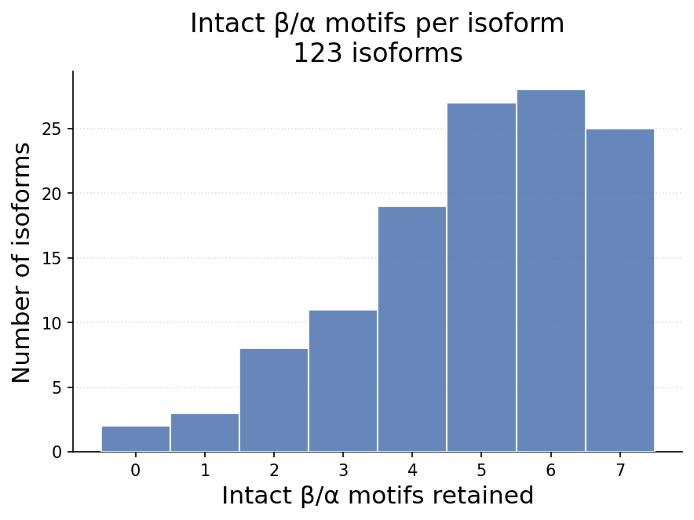

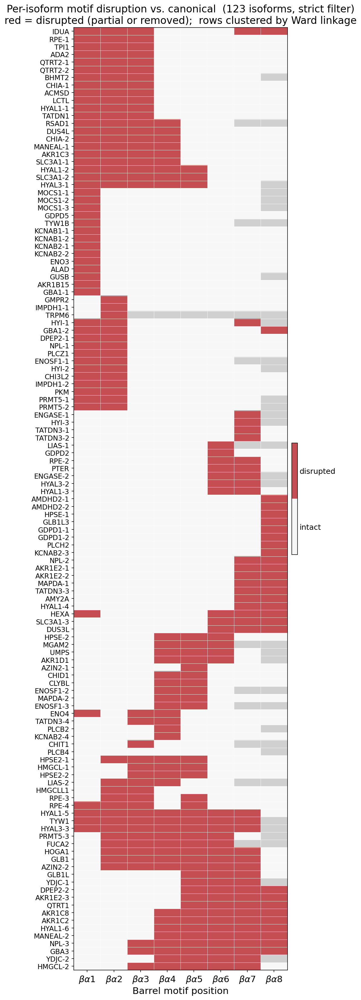

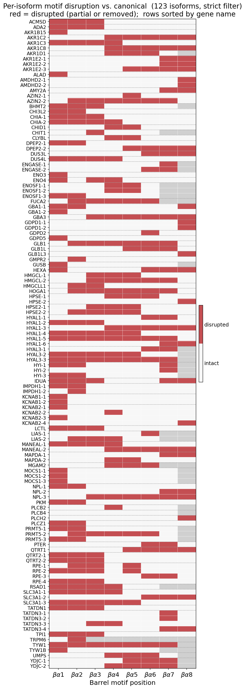

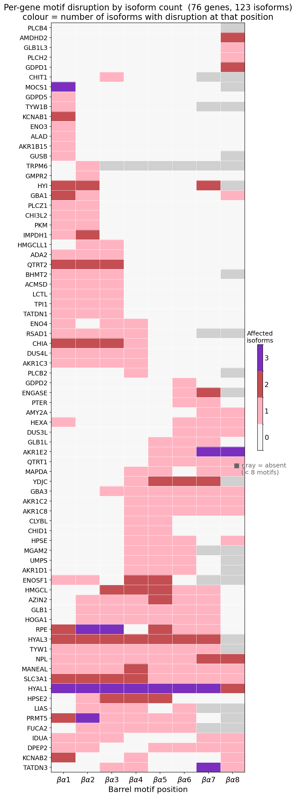

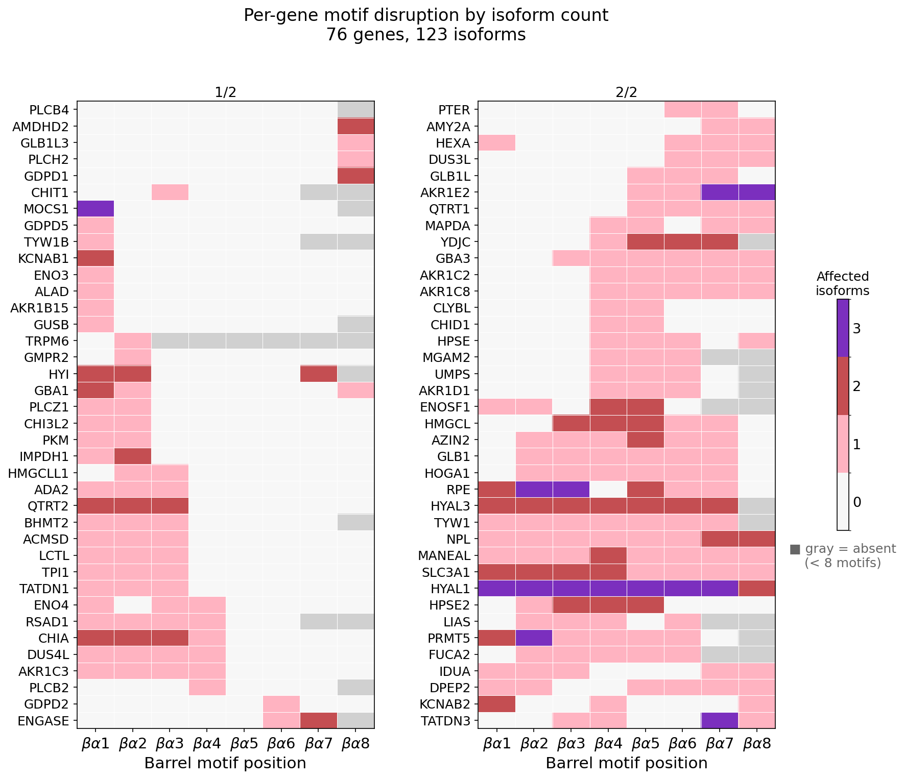

### Conclusion

N-terminal positions 1-2 remain the most disrupted (~40-43%), while position 6
is consistently the least disrupted (28.7%). The mean intact motif count of
4.93 (median 5) confirms that the majority of isoforms retain most of the
barrel, with partial structural disruption rather than wholesale removal being
the typical outcome.

---

## Analysis 6 -- Alternative sequences added by AS isoforms

> **Script:** `scripts/run_alternative_analysis.py` (database query, no dedicated script)

**Question:** Do any AS isoforms add alternative sequence with meaningful functional attributes, rather than merely deleting or disrupting canonical sequence?

**Dataset:** All 123 strict AS isoforms compared against their canonical protein sequences. 16 isoforms are longer than their canonical counterpart.

The extra sequence falls into two structurally distinct categories.

---

### Category 1 -- Alternative N-terminal sequences (subcellular re-targeting)

The most common pattern: the canonical N-terminus is replaced by a longer alternative sequence. Because the TIM barrel domain sequence itself is unaffected (domain alignment recovers the same-length core in all cases), the functional role of these extensions is not enzymatic — they encode **subcellular targeting information**.

| Isoform | Gene | Protein | Canonical N-term | Alt N-term | Net gain |
|---|---|---|---|---|---|
| P20839-7 | IMPDH1 | IMP dehydrogenase 1 | 33 aa | 85 aa | +52 aa |
| P20839-6 | IMPDH1 | IMP dehydrogenase 1 |  1 aa | 86 aa | +85 aa |
| P20839-5 | IMPDH1 | IMP dehydrogenase 1 |  1 aa | 76 aa | +75 aa |
| C9JRZ8-2 | AKR1B15 | Aldo-keto reductase 1B15 | 22 aa | 50 aa | +28 aa |
| P60174-3 | TPI1 | Triosephosphate isomerase |  1 aa | 38 aa | +37 aa |
| P13716-2 | ALAD | Aminolevulinic acid dehydratase | 38 aa | 67 aa | +29 aa |

The clearest documented case is **AKR1B15 isoform 2** (C9JRZ8-2): its alternative N-terminus encodes a mitochondrial targeting signal that redirects the enzyme from the cytoplasm to the mitochondria. **IMPDH1** shows four distinct alternative N-termini across isoforms 3, 5, 6, and 7, consistent with multiple subcellular localisation variants of this key purine-biosynthesis enzyme. **TPI1 isoform 3** (the textbook TIM barrel protein) also gains an N-terminal extension.

**The barrel is not being re-engineered — the cell is re-routing where it gets delivered.**

---

### Category 2 -- Large insertions within the barrel domain (structurally unusual)

Two isoforms replace a single canonical residue with a long alternative sequence at a position **inside** the annotated TIM barrel domain:

| Isoform | Gene | Protein | VSP position | Alt length | Domain range |
|---|---|---|---|---|---|
| Q9Y303-3 | AMDHD2 | N-acetylglucosamine-6-phosphate deacetylase | pos 323 | 186 aa | 67–366 |
| Q9HCC8-3 | GDPD2 | Glycerophosphoinositol phosphodiesterase 2 | pos 436 |  52 aa | 213–480 |

In both cases the domain alignment tool still recovers a full-length TIM barrel core from the isoform (domain sequence length unchanged), implying that the inserted segment sits as a large exon-encoded loop or insertion between two structural units of the barrel — rather than replacing them. The functional role of these inserted segments is not annotated and remains unknown.

**AMDHD2 isoform 3 (+185 aa total) is the most structurally dramatic case in the dataset**: a 186 aa alternative segment inserted within motif position 6 of the barrel (canonical residue 323, lying between βα-repeats 5 and 6 in the domain 67–366).

---

### Conclusion

Alternative splicing in TIM barrel proteins adds functional sequence in two modes:

1. **Subcellular re-targeting** (6+ isoforms): N-terminal substitutions encode organelle-targeting signals, redirecting the barrel enzyme without altering its catalytic core. This is the dominant mode of gain-of-function AS in this dataset.

2. **Intra-barrel insertions** (2 isoforms): Large alternative exons are inserted within the barrel body. The barrel core is preserved, but the biological function of the inserted segments is unknown and warrants further investigation.
