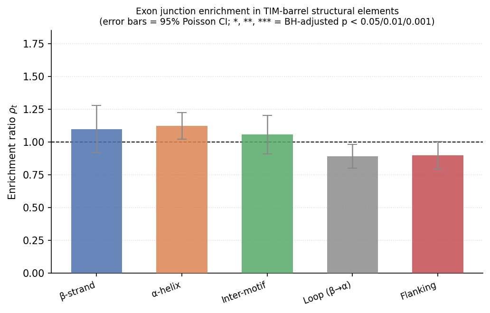
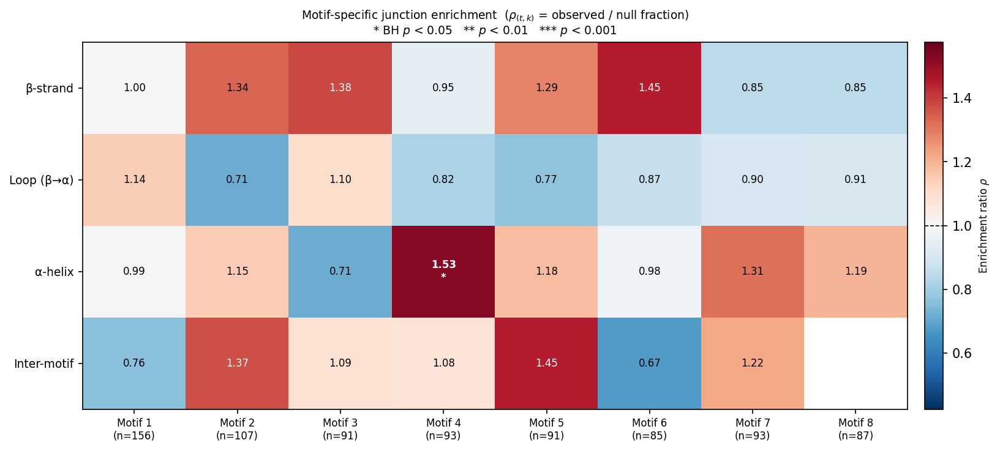
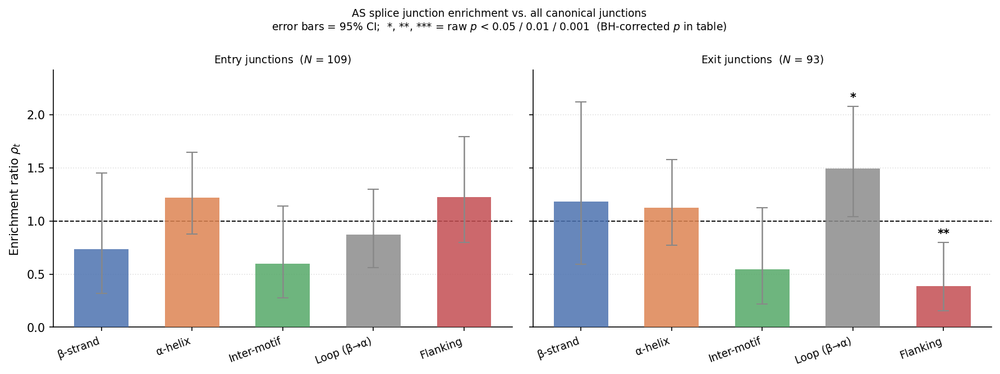
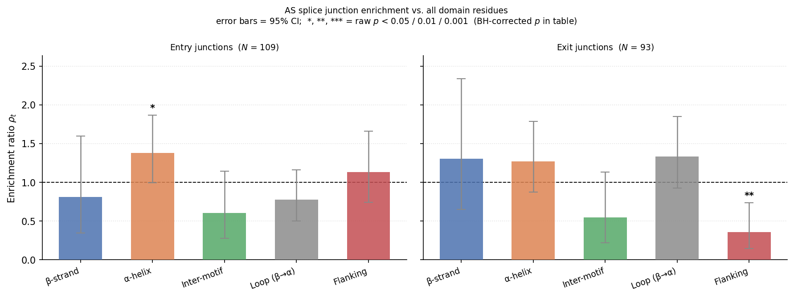
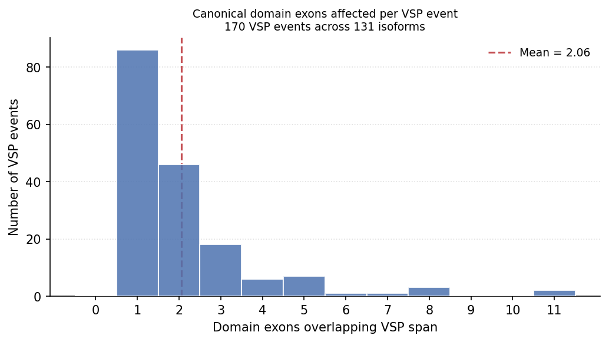
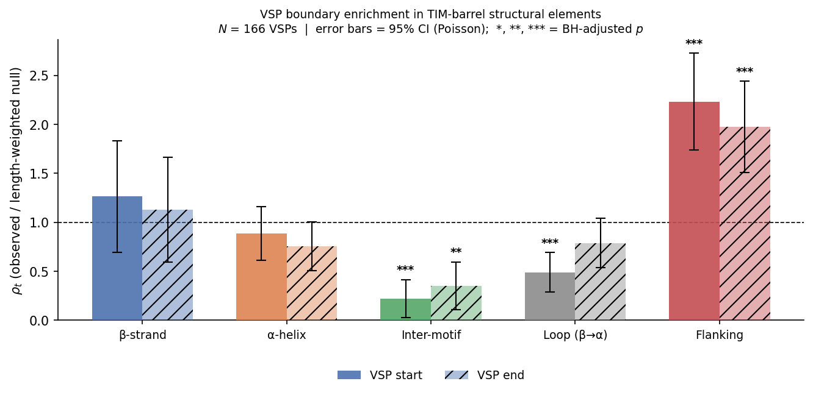
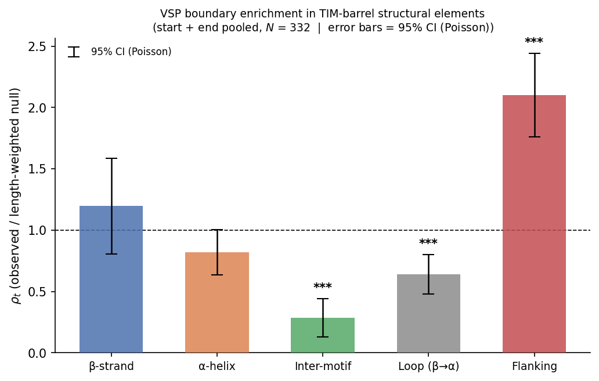
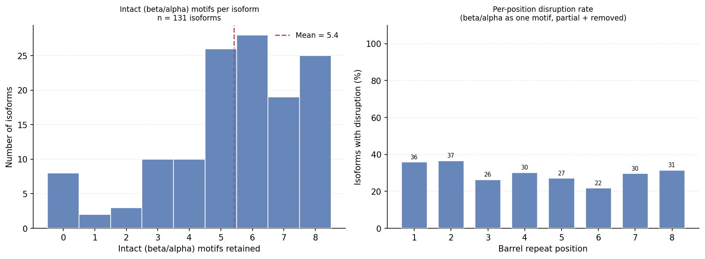
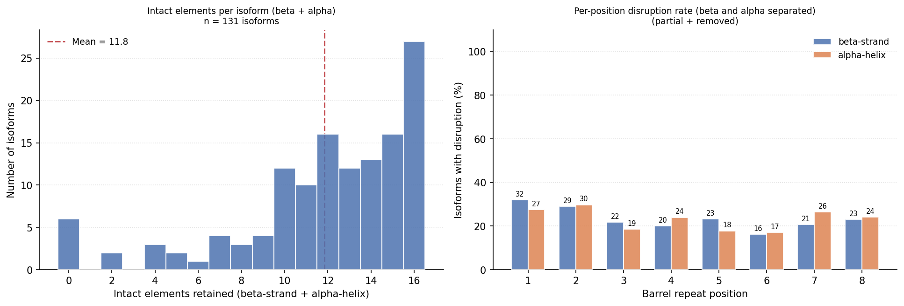

# Results

## Dataset summary

### Canonical proteins

| | Count |
|---|---|
| Total canonical proteins in analysis | 229 |
| — with full 8-motif annotation ($K_p = 8$) | 156 |
| — with partial annotation ($1 \le K_p \le 7$) | 73 |
| — with experimental PDB structure | 84 |
| — AlphaFold structure only | 145 |
| — with ≥ 1 domain-level AS isoform | 74 |
| — with no domain-level AS isoform | 155 |

### Motif-count distribution

| Annotated motifs ($K_p$) | Proteins |
|---|---|
| 1 | 7 |
| 2 | 7 |
| 3 | 7 |
| 4 | 9 |
| 5 | 8 |
| 6 | 12 |
| 7 | 23 |
| 8 | 156 |

### Alternative-splicing isoforms

| | Count |
|---|---|
| Total AS isoforms in analysis | 131 |
| Canonical proteins with ≥ 1 isoform | 74 |
| Mean isoform sequence identity to canonical | 29.3% |
| Min / Max sequence identity | 0.0% / 100.0% |

### AS-isoform count per canonical protein

| Isoforms per canonical | Proteins |
|---|---|
| 0 | 155 |
| 1 | 41 |
| 2 | 21 |
| 3 | 5 |
| 4 | 5 |
| 6 | 1 |
| 7 | 1 |

---

## Notation

| Symbol | Definition |
|---|---|
| $p$ | Index over canonical proteins |
| $d_p^s$, $d_p^e$ | Domain start and end residue positions for protein $p$ |
| $E_p = \{d_p^s, \ldots, d_p^e - 1\}$ | Set of eligible junction positions (domain interior) |
| $\|E_p\|$ | Domain length (number of eligible positions) |
| $n_p$ | Number of exon junctions falling inside the domain of protein $p$ |
| $N = \sum_p n_p$ | Total domain-internal junctions across all canonical proteins |
| $K_p$ | Number of annotated TIM-barrel motifs for protein $p$ |
| $t$ | Structural element type (β-strand, α-helix, loop, inter-motif, flanking) |
| $\tau(r)$ | Element type of residue position $r$ |
| $\lambda_{t,p}$ | Number of eligible positions classified as element $t$ in protein $p$ |
| $q_{t,p} = \lambda_{t,p} / \|E_p\|$ | Fraction of domain positions belonging to element $t$ in protein $p$ |
| $\pi_t^0 = \sum_p n_p q_{t,p} / N$ | Junction-count-weighted null expectation for element $t$ |
| $N_t$ | Observed number of junctions falling in element $t$ |
| $f_t = N_t / N$ | Observed fraction of junctions in element $t$ |
| $\rho_t = f_t / \pi_t^0$ | Enrichment ratio for element $t$ |
| $E_t = N \cdot \pi_t^0$ | Expected junction count in element $t$ under $H_0$ |
| $z_t = (N_t - E_t) / \sqrt{E_t}$ | Pearson z-score for element $t$ |
| $\chi^2 = \sum_t z_t^2$ | Global goodness-of-fit statistic |
| BH $p$ | Benjamini–Hochberg FDR-adjusted p-value |
| VSP | Variant splice protein — a domain-level replacement or deletion event in an AS isoform |
| $\mathcal{A}$ | Set of AS isoforms |
| $J_a^{AS}$ | Canonical junctions inside the VSP span of isoform $a$ |
| $N^{AS} = \sum_a \|J_a^{AS}\|$ | Total AS-affected junction instances |
| $N_t^{AS}$ | Observed AS-affected junctions in element $t$ |
| $f_t^{AS} = N_t^{AS} / N^{AS}$ | Observed fraction of AS junctions in element $t$ |
| $\rho_t^{AS} = f_t^{AS} / f_t$ | Enrichment of AS junctions in element $t$ relative to canonical baseline |
| $\tilde{x}_{a,j} = (j - d_p^s) / \|E_p\|$ | Normalised domain position of AS junction $j$ |
| $D$ | Kolmogorov–Smirnov statistic (max deviation between two empirical CDFs) |
| $\bar{H}$ | Mean within-protein hotspot fraction across multi-isoform proteins |
| $u_p(j)$ | Number of isoforms of protein $p$ whose VSP span includes junction $j$ |
| $(t, k)$ | Motif-element category: element type $t$ at motif number $k$ |
| $N_{(t,k)}$ | Observed junctions in position $(t, k)$ |
| $f_{(t,k)} = N_{(t,k)} / N$ | Observed fraction of junctions in position $(t, k)$ |
| $\pi_{(t,k)}^0$ | Length-weighted null expectation for position $(t, k)$ |
| $\rho_{(t,k)} = f_{(t,k)} / \pi_{(t,k)}^0$ | Enrichment ratio for position $(t, k)$ |
| $s_v = \max(v_s, d_p^s)$ | Domain-clipped VSP start position |
| $e_v = \min(v_e, d_p^e - 1)$ | Domain-clipped VSP end position |
| $L_1 = \sum_t \|f_t^{\text{start}} - f_t^{\text{end}}\|$ | L1 norm of start-end element distribution difference |
| $j^{\text{entry}}$ | Last canonical junction strictly before VSP $\text{can\_start}$ |
| $j^{\text{exit}}$ | First canonical junction at or after the sequence resync point |
| $N^{\text{sp}}$ | Total domain-internal AS splice junctions (entry + exit pooled) |

---

## Analysis 1 — Canonical junction element enrichment

**Script:** `scripts/analyze_junction_enrichment.py`

**Null hypothesis ($H_0$):** Exon junctions are placed proportionally to the length of each structural element — i.e., the enrichment ratio $\rho_t = f_t / \pi_t^0 = 1$ for all element types $t$, where $f_t = N_t / N$ is the observed fraction of junctions falling in element $t$ and $\pi_t^0$ is the length-weighted fraction of the domain occupied by element $t$.

### Results

Global $\chi^2(4) = 15.99$, $p = 0.0030$ ($N = 1453$ junctions, 229 proteins).

| Element | $N_t$ | $f_t$ | $\pi_t^0$ | $\rho_t$ | Raw $p$ | BH $p$ | Sig |
|---|---|---|---|---|---|---|---|
| β-strand    | 145 | 0.100 | 0.091 | 1.100 | 0.250 | 0.312 | ns |
| α-helix     | 459 | 0.316 | 0.281 | 1.124 | 0.012 | 0.061 | ns |
| Inter-motif | 200 | 0.138 | 0.130 | 1.058 | 0.429 | 0.429 | ns |
| Loop (β→α)  | 366 | 0.252 | 0.282 | 0.893 | 0.030 | 0.076 | ns |
| Flanking    | 283 | 0.195 | 0.216 | 0.901 | 0.080 | 0.134 | ns |

### Conclusion

$H_0$ is **rejected** at $\alpha = 0.05$ by the global $\chi^2$ test ($p = 0.0030$). No individual element survives BH correction, but the signal is driven by α-helix enrichment ($\rho = 1.124$, BH $p = 0.061$) and loop depletion ($\rho = 0.893$, BH $p = 0.076$), both just above the correction threshold.

---

## Analysis 2 — Motif-specific element enrichment

**Script:** `scripts/analyze_motif_enrichment.py`

**Null hypothesis ($H_0$):** Junctions are distributed proportionally to the length of each motif-element position — i.e., $\rho_{(t,k)} = f_{(t,k)} / \pi_{(t,k)}^0 = 1$ for all primary categories $(t, k)$.

**Scope:** Restricted to proteins with full 8-motif annotation ($K_p = 8$, $n = 156$). Partially-annotated proteins ($K_p < 8$) are excluded because they concentrate all junctions into fewer motif slots, inflating counts at early positions and deflating those at later ones.

### Results

31 primary categories: $(\beta, k)$, $(\text{loop}, k)$, $(\alpha, k)$ for $k = 1, \ldots, 8$ and $(\text{inter}, k)$ for $k = 1, \ldots, 7$. Flanking positions are excluded (not assigned to a specific motif). BH correction applied across all 31 categories simultaneously ($N = 1120$ total junctions).

| Position | $N_{(t,k)}$ | $\rho_{(t,k)}$ | $z$ | Raw $p$ | BH $p$ | Sig |
|---|---|---|---|---|---|---|
| α-helix 4 | 60 | 1.525 | 3.294 | 0.0010 | 0.031 | * |

All other 30 positions are non-significant after BH correction (lowest BH $p = 0.48$).

### Conclusion

$H_0$ is **rejected** for α-helix 4 specifically ($\rho = 1.525$, BH $p = 0.031$). No other position reaches significance after BH correction. This localises the global α-helix enrichment found in Analysis 1 ($\rho = 1.124$) to the fourth TIM-barrel repeat unit, suggesting that the fourth α-helix is a preferential site for exon boundary placement across the protein family.

---

## Analysis 3 — AS splice junction enrichment in structural elements

**Script:** `scripts/analyze_as_splice_junctions.py`

Unlike Analysis 5 (which used VSP `can_start`/`can_end` coordinates from protein-sequence alignment), this analysis identifies the **actual canonical exon junctions** that define each AS event by direct sequence comparison between canonical and isoform proteins.

For each VSP event, two junctions are extracted:

- **Entry junction** $j^{\text{entry}}$: the last canonical junction strictly before `can_start`. This is the exon boundary after which the canonical and isoform sequences diverge.
- **Exit junction** $j^{\text{exit}}$: the first canonical junction at or after the resync point, where the resync is verified by suffix-matching `canonical[can_end : can_end + 15]` in the isoform sequence (±5 residues slide to absorb annotation imprecision).

Isoforms are matched to Ensembl transcripts by protein sequence (84 isoforms) or stored ENST ID (47 isoforms), giving 131/131 isoforms covered. Isoforms where the suffix match fails because the sequence does not rejoin the canonical (e.g., the isoform ends within the VSP region) are classified as non-rejoining; they contribute an entry junction but no exit junction.

**Dataset:** 170 VSP events across 131 isoforms.

| Category | Count |
|---|---|
| VSP events processed | 170 |
| Truncations — pure prefix of canonical (no exit) | 1 |
| Non-rejoining events — sequence ends within VSP (no exit) | 33 |
| VSPs near canonical C-terminus — tail too short to verify | 35 |
| Resync verified (exit junction assigned) | 101 |

Domain-internal junctions: 109 entry, 93 exit ($N^{\text{sp}} = 202$ pooled).

**Null hypothesis ($H_0$):** AS-flanking junctions are distributed across structural elements in the same proportions as **all canonical domain-internal junctions** ($\pi_t^{\text{junc}}$, computed from Analysis 1). This controls for the fact that canonical junctions are themselves non-uniformly distributed (Analysis 1), so the enrichment ratio $\rho_t = f_t / \pi_t^{\text{junc}}$ measures whether AS-flanking junctions are special relative to a typical canonical junction, not relative to a random residue.

Background junction distribution ($\pi_t^{\text{junc}}$, all canonical domain-internal junctions):

| Element | $\pi_t^{\text{junc}}$ |
|---|---|
| β-strand    | 0.100 |
| α-helix     | 0.316 |
| Inter-motif | 0.138 |
| Loop (β→α)  | 0.252 |
| Flanking    | 0.195 |

### Results

**Entry junctions** ($N = 109$, global $\chi^2(4) = 6.33$, $p = 0.176$):

| Element | $N_t$ | $f_t$ | $\pi_t^{\text{junc}}$ | $\rho_t$ | Raw $p$ | BH $p$ | Sig |
|---|---|---|---|---|---|---|---|
| β-strand    |  8 | 0.073 | 0.100 | 0.735 | 0.383 | 0.479 | ns |
| α-helix     | 42 | 0.385 | 0.316 | 1.220 | 0.197 | 0.479 | ns |
| Inter-motif |  9 | 0.083 | 0.138 | 0.600 | 0.121 | 0.479 | ns |
| Loop (β→α)  | 24 | 0.220 | 0.252 | 0.874 | 0.510 | 0.510 | ns |
| Flanking    | 26 | 0.239 | 0.195 | 1.225 | 0.301 | 0.479 | ns |

**Exit junctions** ($N = 93$, global $\chi^2(4) = 15.93$, $p = 0.003$):

| Element | $N_t$ | $f_t$ | $\pi_t^{\text{junc}}$ | $\rho_t$ | Raw $p$ | BH $p$ | Sig |
|---|---|---|---|---|---|---|---|
| β-strand    | 11 | 0.118 | 0.100 | 1.185 | 0.573 | 0.573 | ns  |
| α-helix     | 33 | 0.355 | 0.316 | 1.123 | 0.504 | 0.573 | ns  |
| Inter-motif |  7 | 0.075 | 0.138 | 0.547 | 0.105 | 0.175 | ns  |
| Loop (β→α)  | 35 | 0.376 | 0.252 | **1.494** | 0.017 | **0.042** | * |
| Flanking    |  7 | 0.075 | 0.195 | **0.386** | 0.009 | **0.042** | * |

**Pooled** ($N^{\text{sp}} = 202$, global $\chi^2(4) = 9.36$, $p = 0.053$):

| Element | $N_t$ | $f_t$ | $\pi_t^{\text{junc}}$ | $\rho_t$ | Raw $p$ | BH $p$ | Sig |
|---|---|---|---|---|---|---|---|
| β-strand    | 19 | 0.094 | 0.100 | 0.943 | 0.796 | 0.796 | ns |
| α-helix     | 75 | 0.371 | 0.316 | 1.175 | 0.161 | 0.390 | ns |
| Inter-motif | 16 | 0.079 | 0.138 | 0.575 | 0.025 | 0.126 | ns |
| Loop (β→α)  | 59 | 0.292 | 0.252 | 1.160 | 0.255 | 0.390 | ns |
| Flanking    | 33 | 0.163 | 0.195 | 0.839 | 0.312 | 0.390 | ns |

*Figure: Entry (left) and exit (right) junctions shown separately. Error bars = 95% CI; stars indicate raw p < 0.05/0.01/0.001 (consistent with CI); BH-corrected p-values are in the tables above.*

### Conclusion (junction null)

Entry junctions show no significant structural preference (global $p = 0.176$): the canonical exon boundary just before an AS event does not fall preferentially at any particular TIM-barrel element, relative to a typical canonical junction.

Exit junctions show a significant structural signal (global $\chi^2(4) = 15.93$, $p = 0.003$), with two BH-significant elements: **loop (β→α) enrichment** ($\rho = 1.494$, BH $p = 0.042$) and **flanking depletion** ($\rho = 0.386$, BH $p = 0.042$). The exon junction at which an isoform rejoins the canonical sequence is over-represented at loops and under-represented at the domain's N/C-terminal flanking regions, relative to all canonical junctions.

---

### Comparison against domain-residue null

Note: Ochoa-Leyva et al. (2013) characterised **where the alternatively spliced region falls in the 3D structure** — i.e., the structural consequence of the AS event — which corresponds to our Analysis 5 (VSP boundary placement). Analysis 3 asks a distinct question: where do the **exon-exon splice junctions** flanking an AS event land in the domain structure. The residue-null comparison below is therefore not a direct replication of Ochoa-Leyva but a parallel measurement at the genomic-architecture level using the same null convention.

We repeat the analysis using the length-weighted residue null $\pi_t^0$ (same as Analyses 1 and 5) to place our splice-junction results on the same scale as structural-impact studies.

**Residue null** ($\pi_t^0$, all 229 canonical domain residues):

| Element | $\pi_t^0$ |
|---|---|
| β-strand    | 0.091 |
| α-helix     | 0.279 |
| Inter-motif | 0.137 |
| Loop (β→α)  | 0.283 |
| Flanking    | 0.211 |

**Entry junctions vs. residue null** ($N = 109$, global $\chi^2(4) = 9.04$, $p = 0.060$):

| Element | $N_t$ | $f_t$ | $\pi_t^0$ | $\rho_t$ | Raw $p$ | BH $p$ | Sig |
|---|---|---|---|---|---|---|---|
| β-strand    |  8 | 0.073 | 0.091 | 0.810 | 0.549 | 0.549 | ns |
| α-helix     | 42 | 0.385 | 0.279 | 1.381 | 0.036 | 0.178 | ns |
| Inter-motif |  9 | 0.083 | 0.137 | 0.603 | 0.125 | 0.313 | ns |
| Loop (β→α)  | 24 | 0.220 | 0.283 | 0.779 | 0.219 | 0.365 | ns |
| Flanking    | 26 | 0.239 | 0.211 | 1.132 | 0.526 | 0.549 | ns |

**Exit junctions vs. residue null** ($N = 93$, global $\chi^2(4) = 16.25$, $p = 0.003$):

| Element | $N_t$ | $f_t$ | $\pi_t^0$ | $\rho_t$ | Raw $p$ | BH $p$ | Sig |
|---|---|---|---|---|---|---|---|
| β-strand    | 11 | 0.118 | 0.091 | 1.305 | 0.376 | 0.376 | ns  |
| α-helix     | 33 | 0.355 | 0.279 | 1.272 | 0.166 | 0.207 | ns  |
| Inter-motif |  7 | 0.075 | 0.137 | 0.550 | 0.108 | 0.180 | ns  |
| Loop (β→α)  | 35 | 0.376 | 0.283 | 1.331 | 0.090 | 0.180 | ns  |
| Flanking    |  7 | 0.075 | 0.211 | **0.357** | 0.004 | **0.022** | * |

*Figure: Entry (left) and exit (right) junctions vs. the domain-residue null. Error bars = 95% CI; stars indicate raw p < 0.05/0.01/0.001; BH-corrected p in table.*

### Conclusion (residue null)

Exit junctions are **significantly depleted from flanking regions** ($\rho = 0.357$, BH $p = 0.022$): the exon boundary at which an isoform rejoins canonical sequence rarely falls at the N/C-terminal ends of the domain. β-strand, α-helix, and loop all show consistent but individually non-significant enrichment (~$\rho \approx 1.3$), indicating a broad preference for splice junctions to land within the core barrel structure rather than outside it.

Entry junctions show no individually significant preference, though α-helix is nominally enriched ($\rho = 1.381$, raw $p = 0.036$, BH $p = 0.178$).

Taken together, the two nulls address different aspects of splice-junction placement: the junction null shows that exit junctions are biased toward loops relative to a typical canonical junction; the residue null shows that both entry and exit junctions avoid the terminal flanking sequence of the domain and land predominantly within the repetitive barrel structure (β/α/loop). This characterises where the splicing machinery operates within the domain architecture, independently of the structural-impact question addressed by Analysis 5.

---

## Analysis 4 — Domain exons affected per VSP event

**Script:** `scripts/analyze_vsp_exon_count.py`

For each VSP event, counts the number of canonical domain exons whose span overlaps with the VSP region $[\text{can\_start}, \text{can\_end}]$. A domain exon is any exon that at least partially overlaps the TIM-barrel domain $[d_p^s, d_p^e]$. Two VSP events in the same isoform are counted separately.

**Dataset:** 170 VSP events across 131 isoforms.

### Results

| Domain exons per VSP | VSP events |
|---|---|
| 1 | 86 |
| 2 | 46 |
| 3 | 18 |
| 4 | 6 |
| 5 | 7 |
| 6 | 1 |
| 7 | 1 |
| 8 | 3 |
| 11 | 2 |

| Statistic | Value |
|---|---|
| Total VSP events | 170 |
| Mean exons per VSP | 2.06 |
| Median exons per VSP | 1.0 |
| Single-exon VSPs | 86 (50.6%) |

### Conclusion

The majority of AS events (50.6%) replace or delete exactly one canonical domain exon. The distribution is strongly right-skewed: most events are minimal single-exon changes, while a small tail of events (11 VSPs, 6.5%) affects 5 or more exons. The mean (2.06) is pulled above the median (1.0) by these larger events.

---

## Analysis 5 — VSP boundary placement in structural elements

> **Caveat:** VSP `can_start`/`can_end` coordinates come from UniProt protein-sequence alignments between the canonical and isoform, not from genomic splice-site coordinates. A sanity check shows that only 23% of VSP boundaries coincide with a canonical exon junction (even allowing ±1 residue), and 51% of VSPs have neither boundary near any junction. This analysis therefore does **not** measure where splice sites fall structurally. It measures where the canonical–isoform sequence difference begins and ends in the domain — which may reflect alternative 5′/3′ splice-site usage, complex multi-exon rearrangements, or alignment shifts at shared flanking residues. Conclusions should be read with this in mind.

**Script:** `scripts/analyze_vsp_boundaries.py`

For each VSP with domain overlap, the domain-clipped start $s_v = \max(v_s, d_p^s)$ and end $e_v = \min(v_e, d_p^e - 1)$ are each assigned to a structural element using the $\tau_5$ classifier. The enrichment ratio $\rho_t = f_t / \pi_t^0$ compares the observed fraction of VSP boundaries in element $t$ to the length-weighted null $\pi_t^0$ (fraction of domain residues in each element across all 229 canonical proteins). Significance is assessed by a Pearson z-score test with BH correction across the five element types.

**Dataset:** $N = 166$ VSP spans across 74 distinct canonical proteins.

### Results

**VSP start positions** ($N = 166$):

| Element | $N_t$ | $f_t$ | $\pi_t^0$ | $\rho_t$ | Raw $p$ | BH $p$ | Sig |
|---|---|---|---|---|---|---|---|
| β-strand    |  19 | 0.114 | 0.091 | 1.263 | 0.3085 | 0.3856 | ns  |
| α-helix     |  41 | 0.247 | 0.279 | 0.885 | 0.4355 | 0.4355 | ns  |
| Inter-motif |   5 | 0.030 | 0.137 | 0.220 | 0.0002 | 0.0005 | *** |
| Loop (β→α)  |  23 | 0.139 | 0.283 | 0.490 | 0.0005 | 0.0008 | *** |
| Flanking    |  78 | 0.470 | 0.211 | 2.231 | <0.0001 | <0.0001 | *** |

**VSP end positions** ($N = 166$):

| Element | $N_t$ | $f_t$ | $\pi_t^0$ | $\rho_t$ | Raw $p$ | BH $p$ | Sig |
|---|---|---|---|---|---|---|---|
| β-strand    |  17 | 0.102 | 0.091 | 1.130 | 0.6151 | 0.6151 | ns  |
| α-helix     |  35 | 0.211 | 0.279 | 0.756 | 0.0966 | 0.1610 | ns  |
| Inter-motif |   8 | 0.048 | 0.137 | 0.352 | 0.0020 | 0.0050 | **  |
| Loop (β→α)  |  37 | 0.223 | 0.283 | 0.788 | 0.1465 | 0.1831 | ns  |
| Flanking    |  69 | 0.416 | 0.211 | 1.973 | <0.0001 | <0.0001 | *** |

**Pooled (start + end combined, $N = 332$):**

| Element | $N_t$ | $f_t$ | $\pi_t^0$ | $\rho_t$ | BH $p$ | Sig |
|---|---|---|---|---|---|---|
| β-strand    |  36 | 0.109 | 0.091 | 1.196 | 0.2821 | ns  |
| α-helix     |  76 | 0.229 | 0.279 | 0.821 | 0.1054 | ns  |
| Inter-motif |  13 | 0.039 | 0.137 | 0.286 | <0.0001 | *** |
| Loop (β→α)  |  60 | 0.181 | 0.283 | 0.639 | 0.0008 | *** |
| Flanking    | 147 | 0.443 | 0.211 | 2.102 | <0.0001 | *** |

### Conclusion

Both VSP start and end positions show the same structural preference: strong enrichment in flanking regions (start: $\rho = 2.231$, BH $p < 0.0001$; end: $\rho = 1.973$, BH $p < 0.0001$) and depletion from inter-motif linkers (start: $\rho = 0.220$, BH $p = 0.0005$; end: $\rho = 0.352$, BH $p = 0.005$). Loop depletion is significant at the start position only ($\rho = 0.490$, BH $p = 0.0008$). When both boundaries are pooled ($N = 332$), the signal strengthens: flanking $\rho = 2.102$, inter-motif $\rho = 0.286$, and loop $\rho = 0.639$ all reach BH significance. AS-altered spans consistently enter and exit the domain at non-barrel flanking sequence, avoiding the inter-motif linkers and loops that connect the barrel repeats.

---

## Analysis 6: Structural impact on barrel architecture

For each isoform with VSP domain events, we classify the fate of each canonical TIM-barrel element using two levels of granularity: (i) each (β/α) repeat unit treated as one motif, and (ii) β-strand and α-helix classified independently. In both cases the state is:

| Class | Definition |
|---|---|
| **intact** | no overlap with any VSP region |
| **partial** | VSP partially overlaps the element |
| **removed** | VSP fully contains the element |

For isoforms with multiple VSPs, the worst state across all events is used. All 131 isoforms with at least one VSP domain event are included.

### Combined: (β/α) repeat as one motif

Each motif is classified over its full span [β_start, α_end].

**Intact motif count distribution** ($n = 131$ isoforms):

| Intact motifs | Isoforms | % |
|---|---|---|
| 0 |  8 |  6.1% |
| 1 |  2 |  1.5% |
| 2 |  3 |  2.3% |
| 3 | 10 |  7.6% |
| 4 | 10 |  7.6% |
| 5 | 26 | 19.8% |
| 6 | 28 | 21.4% |
| 7 | 19 | 14.5% |
| 8 | 25 | 19.1% |

Mean intact motifs: **5.4** (median 6). The distribution is bimodal: a majority cluster (55%) retains 5–8 motifs, while a minority (17%) retains ≤ 3. Approximately one in five isoforms (19%) has a fully intact barrel; one in sixteen (6%) is completely disrupted.

**Per-position disruption rate** (partial + removed):

| Position | Disrupted / Total | Rate |
|---|---|---|
| 1 | 47 / 131 | 35.9% |
| 2 | 48 / 131 | 36.6% |
| 3 | 34 / 129 | 26.4% |
| 4 | 39 / 129 | 30.2% |
| 5 | 35 / 129 | 27.1% |
| 6 | 28 / 129 | 21.7% |
| 7 | 37 / 125 | 29.6% |
| 8 | 34 / 108 | 31.5% |

Positions 1–2 show the highest disruption rates (~36%), consistent with the Analysis 5 finding that VSP boundaries are enriched near the domain's N-terminal edge. Position 6 is least disrupted (22%).

*Figure: (Left) Intact (β/α) motifs retained per isoform. (Right) Per-barrel-position disruption rate, treating each repeat as one unit.*

### Separate: β-strand and α-helix classified independently

β-strands [β_start, β_end] and α-helices [α_start, α_end] are classified against the same VSP regions independently.

**Per-position disruption rate** (partial + removed, β and α separate):

| Position | β disrupted | β rate | α disrupted | α rate |
|---|---|---|---|---|
| 1 | 42 / 131 | 32.1% | 36 / 131 | 27.5% |
| 2 | 38 / 131 | 29.0% | 39 / 131 | 29.8% |
| 3 | 28 / 129 | 21.7% | 24 / 129 | 18.6% |
| 4 | 26 / 129 | 20.2% | 31 / 129 | 24.0% |
| 5 | 30 / 129 | 23.3% | 23 / 129 | 17.8% |
| 6 | 21 / 129 | 16.3% | 22 / 129 | 17.1% |
| 7 | 26 / 125 | 20.8% | 33 / 125 | 26.4% |
| 8 | 25 / 108 | 23.1% | 26 / 108 | 24.1% |

Mean intact elements: **11.9 / 16** (5.9 β-strands + 5.9 α-helices). β-strands and α-helices are disrupted at essentially identical rates at every barrel position; VSPs show no systematic preference for one element type over the other.

*Figure: (Left) Intact elements (β + α) per isoform (max 16). (Right) Per-position disruption rate with β-strands (blue) and α-helices (orange) shown separately.*

### Conclusion

AS events in TIM-barrel proteins typically preserve a majority of the canonical repeat architecture (mean 5.4 / 8 motifs; 11.9 / 16 elements intact). Disruption is modestly concentrated at N-terminal positions (1–2, ~36%), but β-strands and α-helices within each repeat are equally susceptible. One in five isoforms retains a fully intact barrel. When VSPs introduce novel isoform-specific replacement sequence (27 of 95 single-VSP isoforms with structures), AlphaFold predicts those regions to be disordered (mean pLDDT = 49.7 vs. 82.7 pre-VSP and 90.9 post-VSP; all pairwise comparisons $p < 0.001$, Mann-Whitney U), suggesting TIM-barrel AS isoforms predominantly *remove* a defined barrel segment rather than substitute one folded structure for another.
