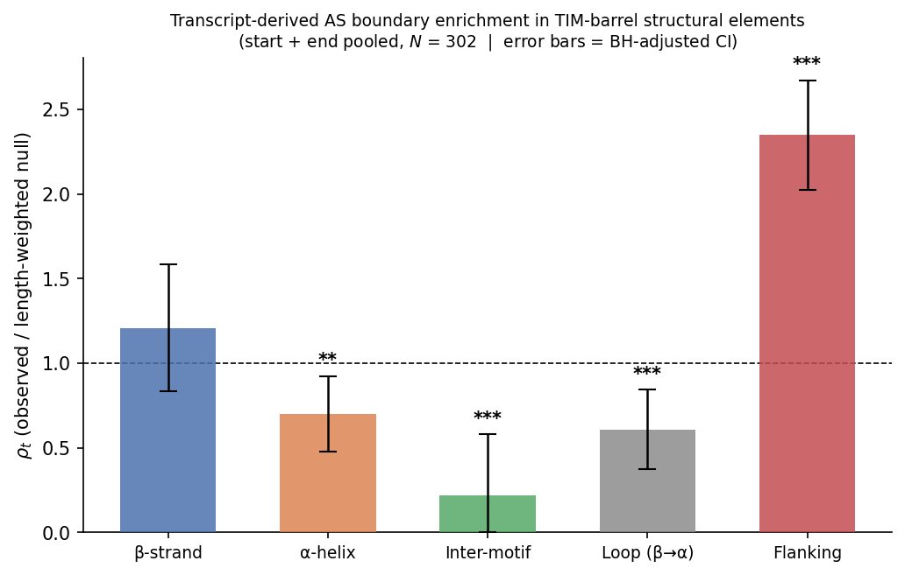
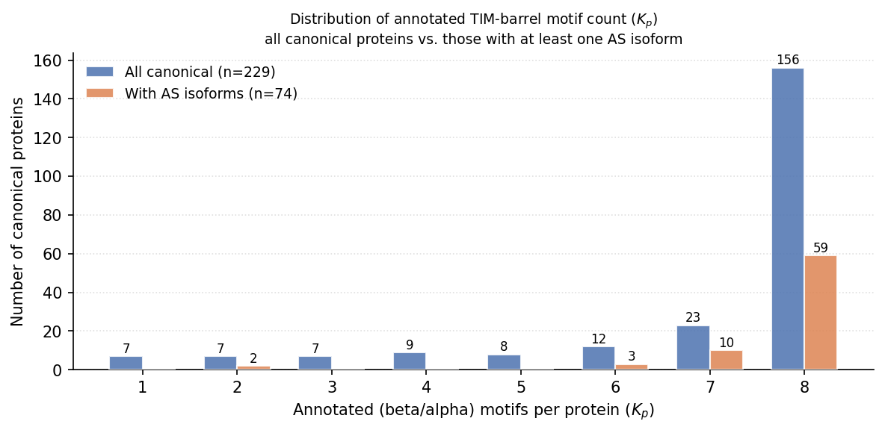
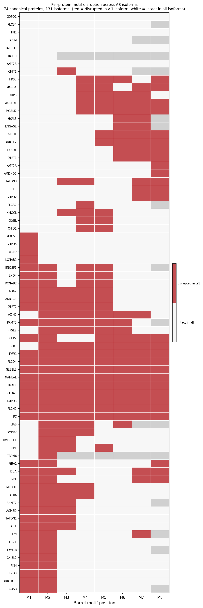

# Results

## Dataset summary

The total number of proteins, canonical and non-canonical, is 360.

### Canonical proteins

| | Count |
|---|---|
| Total canonical proteins in analysis | 229 |
| — with full 8-motif annotation ($K_p = 8$) | 156 |
| — with partial annotation ($1 \le K_p \le 7$) | 73 |
| — with experimental PDB structure | 84 |
| — AlphaFold structure only | 145 |
| — with ≥ 1 domain-level AS isoform | 74 |
| — with no domain-level AS isoform | 155 |

### Motif-count distribution

| Annotated motifs ($K_p$) | Proteins |
|---|---|
| 1 | 7 |
| 2 | 7 |
| 3 | 7 |
| 4 | 9 |
| 5 | 8 |
| 6 | 12 |
| 7 | 23 |
| 8 | 156 |

### Alternative-splicing isoforms

| | Count |
|---|---|
| Total AS isoforms in analysis | 131 |
| Canonical proteins with ≥ 1 isoform | 74 |
| Mean isoform sequence identity to canonical | 29.3% |
| Min / Max sequence identity | 0.0% / 100.0% |

### AS-isoform count per canonical protein

| Isoforms per canonical | Proteins |
|---|---|
| 0 | 155 |
| 1 | 41 |
| 2 | 21 |
| 3 | 5 |
| 4 | 5 |
| 6 | 1 |
| 7 | 1 |

> **Exclusion note — Ensembl-transcript-based analyses (§5 onward):**
> 13 of the 229 canonical proteins lack a matched Ensembl transcript in the database and are therefore excluded from all analyses that use Ensembl exon-junction coordinates as the authoritative junction source.
> These 13 proteins are: A0A286YF17 (MTHFR), A0A2R8Y4U7 (MANBA), A0A494C064 (MTR), A0A7P0T956 (MTR), A0A8Q3SI69 (ADA), A0AAQ5BGL9 (MOCS1), D6REY1 (CHIT1), E9PCX2 (AKR1B1), G3V255 (GALC), H0Y4E4 (LCT), H7C1W4, P16278 (GLB1), P20839 (IMPDH1).
> Two of these (GLB1 and IMPDH1) have domain-level AS isoforms; the remaining 11 have no isoforms and affect only the canonical null distribution.
> All Ensembl-based analyses therefore run on **216 canonical proteins** (94% of the full set), of which **72 have ≥ 1 domain-level AS isoform**.

---

## Notation

| Symbol | Definition |
|---|---|
| $p$ | Index over canonical proteins |
| $d_p^s$, $d_p^e$ | Domain start and end residue positions for protein $p$ |
| $E_p = \{d_p^s, \ldots, d_p^e - 1\}$ | Set of eligible junction positions (domain interior) |
| $\|E_p\|$ | Domain length (number of eligible positions) |
| $n_p$ | Number of exon junctions falling inside the domain of protein $p$ |
| $N = \sum_p n_p$ | Total domain-internal junctions across all canonical proteins |
| $K_p$ | Number of annotated TIM-barrel motifs for protein $p$ |
| $t$ | Structural element type (β-strand, α-helix, loop, inter-motif, flanking) |
| $\tau(r)$ | Element type of residue position $r$ |
| $\lambda_{t,p}$ | Number of eligible positions classified as element $t$ in protein $p$ |
| $q_{t,p} = \lambda_{t,p} / \|E_p\|$ | Fraction of domain positions belonging to element $t$ in protein $p$ |
| $\pi_t^0 = \sum_p n_p q_{t,p} / N$ | Junction-count-weighted null expectation for element $t$ |
| $N_t$ | Observed number of junctions falling in element $t$ |
| $f_t = N_t / N$ | Observed fraction of junctions in element $t$ |
| $\rho_t = f_t / \pi_t^0$ | Enrichment ratio for element $t$ |
| $E_t = N \cdot \pi_t^0$ | Expected junction count in element $t$ under $H_0$ |
| $z_t = (N_t - E_t) / \sqrt{E_t}$ | Pearson z-score for element $t$ |
| $\chi^2 = \sum_t z_t^2$ | Global goodness-of-fit statistic |
| BH $p$ | Benjamini–Hochberg FDR-adjusted p-value |
| VSP | Variant splice protein — a domain-level replacement or deletion event in an AS isoform |
| $\mathcal{A}$ | Set of AS isoforms |
| $J_a^{AS}$ | Canonical junctions inside the VSP span of isoform $a$ |
| $N^{AS} = \sum_a \|J_a^{AS}\|$ | Total AS-affected junction instances |
| $N_t^{AS}$ | Observed AS-affected junctions in element $t$ |
| $f_t^{AS} = N_t^{AS} / N^{AS}$ | Observed fraction of AS junctions in element $t$ |
| $\rho_t^{AS} = f_t^{AS} / f_t$ | Enrichment of AS junctions in element $t$ relative to canonical baseline |
| $\tilde{x}_{a,j} = (j - d_p^s) / \|E_p\|$ | Normalised domain position of AS junction $j$ |
| $D$ | Kolmogorov–Smirnov statistic (max deviation between two empirical CDFs) |
| $\bar{H}$ | Mean within-protein hotspot fraction across multi-isoform proteins |
| $u_p(j)$ | Number of isoforms of protein $p$ whose VSP span includes junction $j$ |
| $(t, k)$ | Motif-element category: element type $t$ at motif number $k$ |
| $N_{(t,k)}$ | Observed junctions in position $(t, k)$ |
| $f_{(t,k)} = N_{(t,k)} / N$ | Observed fraction of junctions in position $(t, k)$ |
| $\pi_{(t,k)}^0$ | Length-weighted null expectation for position $(t, k)$ |
| $\rho_{(t,k)} = f_{(t,k)} / \pi_{(t,k)}^0$ | Enrichment ratio for position $(t, k)$ |
| $s_v = \max(v_s, d_p^s)$ | Domain-clipped VSP start position |
| $e_v = \min(v_e, d_p^e - 1)$ | Domain-clipped VSP end position |
| $D_{\text{seq}}$ | Transcript-derived AS start: first canonical residue where isoform and canonical sequences diverge (Analysis 3) |
| $R_{\text{can}}$ | Transcript-derived AS end: first canonical residue where sequences rejoin after the AS region (Analysis 3); $R_{\text{can}}-1$ = last diverged position |

---

## Analysis 1 — Canonical junction element enrichment

**Script:** `scripts/analyze_junction_enrichment.py`

**Null hypothesis ($H_0$):** Exon junctions are placed proportionally to the length of each structural element — i.e., the enrichment ratio $\rho_t = f_t / \pi_t^0 = 1$ for all element types $t$, where $f_t = N_t / N$ is the observed fraction of junctions falling in element $t$ and $\pi_t^0$ is the length-weighted fraction of the domain occupied by element $t$.

### Results

Global $\chi^2(4) = 21.34$, $p = 0.0003$ ($N = 1411$ junctions, 216 proteins).

| Element | $N_t$ | $f_t$ | $\pi_t^0$ | $\rho_t$ | Raw $p$ | BH $p$ | Sig |
|---|---|---|---|---|---|---|---|
| β-strand    | 147 | 0.104 | 0.090 | 1.155 | 0.080 | 0.099 | ns |
| α-helix     | 450 | 0.319 | 0.282 | 1.130 | 0.009 | 0.024 | *  |
| Inter-motif | 196 | 0.139 | 0.129 | 1.077 | 0.301 | 0.301 | ns |
| Loop (β→α)  | 350 | 0.248 | 0.285 | 0.871 | 0.010 | 0.024 | *  |
| Flanking    | 268 | 0.190 | 0.214 | 0.889 | 0.054 | 0.089 | ns |

### Conclusion

$H_0$ is **rejected** ($\chi^2(4) = 21.34$, $p = 0.0003$). Two elements survive BH correction at $\alpha = 0.05$: **α-helix enrichment** ($\rho = 1.130$, BH $p = 0.024$) and **loop (β→α) depletion** ($\rho = 0.871$, BH $p = 0.024$). Exon junctions are over-represented within α-helices and under-represented in loop regions relative to their domain-length expectation. β-strand shows a descriptive enrichment trend ($\rho = 1.155$, BH $p = 0.099$) that does not reach significance after correction. These results are based on 216 Ensembl-matched canonical proteins (13 without a matched Ensembl transcript excluded; see exclusion note above).

---

## Analysis 2 — Motif-specific element enrichment

**Script:** `scripts/analyze_motif_enrichment.py`

**Null hypothesis ($H_0$):** Junctions are distributed proportionally to the length of each motif-element position — i.e., $\rho_{(t,k)} = f_{(t,k)} / \pi_{(t,k)}^0 = 1$ for all primary categories $(t, k)$.

**Scope:** Restricted to proteins with full 8-motif annotation ($K_p = 8$, $n = 151$). Partially-annotated proteins ($K_p < 8$) are excluded because they concentrate all junctions into fewer motif slots, inflating counts at early positions and deflating those at later ones.

### Results

31 primary categories: $(\beta, k)$, $(\text{loop}, k)$, $(\alpha, k)$ for $k = 1, \ldots, 8$ and $(\text{inter}, k)$ for $k = 1, \ldots, 7$. Flanking positions are excluded (not assigned to a specific motif). BH correction applied across all 31 categories simultaneously ($N = 1108$ total junctions).

| Position | $N_{(t,k)}$ | $\rho_{(t,k)}$ | $z$ | Raw $p$ | BH $p$ | Sig |
|---|---|---|---|---|---|---|
| α-helix 4 | 60 | 1.535 | 3.347 | 0.0008 | 0.025 | * |

All other 30 positions are non-significant after BH correction (lowest BH $p = 0.48$).

### Conclusion

$H_0$ is **rejected** for α-helix 4 specifically ($\rho = 1.535$, BH $p = 0.025$). No other position reaches significance after BH correction. This localises the global α-helix enrichment found in Analysis 1 ($\rho = 1.130$) to the fourth TIM-barrel repeat unit, suggesting that the fourth α-helix is a preferential site for exon boundary placement across the protein family.

---

## Analysis 3 — Transcript-derived AS boundary enrichment in structural elements

**Script:** `scripts/analyze_as_splice_junctions.py`

This analysis is the transcript-level counterpart of Analysis 4 (VSP boundary enrichment). Instead of using annotated VSP coordinates (can_start, can_end), it locates the boundaries of the alternatively spliced region by direct protein sequence comparison:

- **$D_{\text{seq}}$**: first canonical residue where the isoform and canonical protein sequences differ — the transcript-derived **start** of the AS region.
- **$R_{\text{can}} - 1$**: last canonical residue before the sequences rejoin, found by suffix-matching 15 residues of `canonical[can_end : can_end+15]` in the isoform (±5 residue slide). VSP `can_end` is used only as the starting hint; **it does not define the AS boundary.** This is the transcript-derived **end** of the AS region.

Both boundaries are domain-clipped ($s_t = \max(D_{\text{seq}}, d_p^s)$, $e_t = \min(R_{\text{can}}-1, d_p^e - 1)$) and classified by structural element using the $\tau_5$ classifier. Enrichment is computed against the length-weighted **residue null** $\pi_t^0$, identical to the null used in Analysis 4, making the two analyses directly comparable.

Proteins without a matched Ensembl transcript are excluded (see exclusion note above). No Ensembl isoform-transcript match is required — only the stored protein sequences and VSP events are used.

**Dataset:** 216 canonical proteins; 131 isoforms; 151 isoform+VSP pairs where the AS region overlaps the domain (includes resyncing isoforms where $R_{\text{can}}$ is sequence-derived, and truncating isoforms where VSP `can_end` is used as the end boundary).

**Null hypothesis ($H_0$):** AS region boundaries are distributed across structural elements proportionally to domain length ($\rho_t = 1$ for all $t$).

**Residue null** ($\pi_t^0$, 216 canonical proteins):

| Element | $\pi_t^0$ |
|---|---|
| β-strand    | 0.091 |
| α-helix     | 0.279 |
| Inter-motif | 0.137 |
| Loop (β→α)  | 0.283 |
| Flanking    | 0.210 |

### Results

**Transcript start positions ($D_{\text{seq}}$, $N = 151$, global $\chi^2(4) = 114.04$, $p < 0.0001$):**

| Element | $N_t$ | $f_t$ | $\pi_t^0$ | $\rho_t$ | Raw $p$ | BH $p$ | Sig |
|---|---|---|---|---|---|---|---|
| β-strand    | 21 | 0.139 | 0.091 | 1.537 | 0.047 | 0.059 | ns  |
| α-helix     | 32 | 0.212 | 0.279 | 0.759 | 0.117 | 0.117 | ns  |
| Inter-motif |  1 | 0.007 | 0.137 | **0.048** | <0.001 | **<0.001** | *** |
| Loop (β→α)  | 17 | 0.113 | 0.283 | **0.398** | <0.001 | **<0.001** | *** |
| Flanking    | 80 | 0.530 | 0.210 | **2.521** | <0.001 | **<0.001** | *** |

**Transcript end positions ($R_{\text{can}}-1$, $N = 151$, global $\chi^2(4) = 58.61$, $p < 0.0001$):**

| Element | $N_t$ | $f_t$ | $\pi_t^0$ | $\rho_t$ | Raw $p$ | BH $p$ | Sig |
|---|---|---|---|---|---|---|---|
| β-strand    | 12 | 0.079 | 0.091 | 0.878 | 0.653 | 0.653 | ns  |
| α-helix     | 27 | 0.179 | 0.279 | 0.640 | 0.019 | 0.032 | *   |
| Inter-motif |  8 | 0.053 | 0.137 | **0.387** | 0.005 | **0.013** | *   |
| Loop (β→α)  | 35 | 0.232 | 0.283 | 0.819 | 0.237 | 0.296 | ns  |
| Flanking    | 69 | 0.457 | 0.210 | **2.174** | <0.001 | **<0.001** | *** |

**Pooled (start + end combined, $N = 302$):**

| Element | $N_t$ | $f_t$ | $\pi_t^0$ | $\rho_t$ | BH $p$ | Sig |
|---|---|---|---|---|---|---|
| β-strand    |  33 | 0.109 | 0.091 | 1.208 | 0.278 | ns  |
| α-helix     |  59 | 0.195 | 0.279 | 0.699 | 0.007 | **  |
| Inter-motif |   9 | 0.030 | 0.137 | 0.217 | <0.001 | *** |
| Loop (β→α)  |  52 | 0.172 | 0.283 | 0.608 | <0.001 | *** |
| Flanking    | 149 | 0.493 | 0.210 | 2.348 | <0.001 | *** |

### Conclusion

Transcript-derived start and end positions both replicate the core finding of Analysis 4. **Start positions** ($N = 151$): AS events preferentially begin in **flanking regions** ($\rho = 2.521$, BH $p < 0.001$, \*\*\*) and are depleted from **inter-motif linkers** ($\rho = 0.048$, BH $p < 0.001$, \*\*\*) and **loops** ($\rho = 0.398$, BH $p < 0.001$, \*\*\*), mirroring the Analysis 4 start-position pattern. **End positions** ($N = 151$): **flanking regions** are again enriched ($\rho = 2.174$, BH $p < 0.001$, \*\*\*) and **inter-motif linkers** depleted ($\rho = 0.387$, BH $p = 0.013$, \*), consistent with the Analysis 4 end-position signal. When both boundaries are pooled ($N = 302$), α-helix depletion reaches significance ($\rho = 0.699$, BH $p = 0.007$, \*\*), matching the pattern seen in the Analysis 4 pooled result ($\rho = 0.762$, BH $p = 0.038$). The agreement across both boundaries and both methods (sequence-derived vs. VSP-annotation-derived) confirms that AS events in TIM-barrel proteins enter and exit the domain at flanking sequence, avoiding the barrel's connecting linkers.

---

## Analysis 4 — VSP boundary placement in structural elements

**Script:** `scripts/analyze_vsp_boundaries.py`

For each VSP with domain overlap, the domain-clipped start $s_v = \max(v_s, d_p^s)$ and end $e_v = \min(v_e, d_p^e - 1)$ are each assigned to a structural element using the $\tau_5$ classifier. The enrichment ratio $\rho_t = f_t / \pi_t^0$ compares the observed fraction of VSP boundaries in element $t$ to the length-weighted null $\pi_t^0$ (fraction of domain residues in each element across the 216 Ensembl-matched canonical proteins). Significance is assessed by a Pearson z-score test with BH correction across the five element types.

**Dataset:** $N = 148$ VSP spans across 68 distinct canonical proteins (216 Ensembl-matched proteins; 13 proteins without a matched Ensembl transcript excluded; VSP events where the isoform sequence does not diverge from canonical before `can_end` are additionally excluded as annotation artefacts, consistent with the sequence-comparison approach of Analysis 3).

### Results

**VSP start positions** ($N = 148$):

| Element | $N_t$ | $f_t$ | $\pi_t^0$ | $\rho_t$ | Raw $p$ | BH $p$ | Sig |
|---|---|---|---|---|---|---|---|
| β-strand    |  17 | 0.115 | 0.090 | 1.270 | 0.324 | 0.324 | ns  |
| α-helix     |  35 | 0.236 | 0.279 | 0.847 | 0.324 | 0.324 | ns  |
| Inter-motif |   4 | 0.027 | 0.137 | 0.197 | 0.0003 | 0.0008 | *** |
| Loop (β→α)  |  20 | 0.135 | 0.283 | 0.478 | 0.0007 | 0.0012 | *** |
| Flanking    |  72 | 0.486 | 0.210 | 2.315 | <0.0001 | <0.0001 | *** |

**VSP end positions** ($N = 148$):

| Element | $N_t$ | $f_t$ | $\pi_t^0$ | $\rho_t$ | Raw $p$ | BH $p$ | Sig |
|---|---|---|---|---|---|---|---|
| β-strand    |  16 | 0.108 | 0.090 | 1.195 | 0.476 | 0.476 | ns  |
| α-helix     |  28 | 0.189 | 0.279 | 0.677 | 0.038 | 0.063 | ns  |
| Inter-motif |   7 | 0.047 | 0.137 | 0.345 | 0.003 | 0.008 | **  |
| Loop (β→α)  |  34 | 0.230 | 0.283 | 0.812 | 0.223 | 0.279 | ns  |
| Flanking    |  63 | 0.426 | 0.210 | 2.026 | <0.0001 | <0.0001 | *** |

**Pooled (start + end combined, $N = 296$):**

| Element | $N_t$ | $f_t$ | $\pi_t^0$ | $\rho_t$ | BH $p$ | Sig |
|---|---|---|---|---|---|---|
| β-strand    |  33 | 0.111 | 0.090 | 1.232 | 0.230 | ns  |
| α-helix     |  63 | 0.213 | 0.279 | 0.762 | 0.038 | *   |
| Inter-motif |  11 | 0.037 | 0.137 | 0.271 | <0.0001 | *** |
| Loop (β→α)  |  54 | 0.182 | 0.283 | 0.645 | 0.002 | **  |
| Flanking    | 135 | 0.456 | 0.210 | 2.170 | <0.0001 | *** |

### Conclusion

Both VSP start and end positions show the same structural preference: strong enrichment in flanking regions (start: $\rho = 2.315$, BH $p < 0.0001$; end: $\rho = 2.026$, BH $p < 0.0001$) and depletion from inter-motif linkers (start: $\rho = 0.197$, BH $p = 0.0008$; end: $\rho = 0.345$, BH $p = 0.008$). Loop depletion is significant at the start position only ($\rho = 0.478$, BH $p = 0.0012$). α-helix depletion at end positions ($\rho = 0.677$, BH $p = 0.063$) mirrors the significant depletion found in Analysis 3 ($\rho = 0.640$, BH $p = 0.032$); it falls just short of the BH threshold here due to the coarser VSP annotation boundaries compared to the sequence-derived $R_{\text{can}}-1$ positions of Analysis 3. When both boundaries are pooled ($N = 296$), α-helix depletion reaches significance ($\rho = 0.762$, BH $p = 0.038$). AS-altered spans consistently enter and exit the domain at non-barrel flanking sequence, avoiding the inter-motif linkers and loops that connect the barrel repeats.

---

## Analysis 5: Structural impact on barrel architecture

For each isoform with VSP domain events, we classify the fate of each canonical TIM-barrel element using two levels of granularity: (i) each (β/α) repeat unit treated as one motif, and (ii) β-strand and α-helix classified independently. In both cases the state is:

| Class | Definition |
|---|---|
| **intact** | no overlap with any VSP region |
| **partial** | VSP partially overlaps the element |
| **removed** | VSP fully contains the element |

For isoforms with multiple VSPs, the worst state across all events is used. All 131 isoforms with at least one VSP domain event are included.

**Canonical motif-count distribution** ($n = 229$ proteins):

| Annotated motifs ($K_p$) | All canonical | With AS isoforms |
|---|---|---|
| 1 |  7 |  0 |
| 2 |  7 |  2 |
| 3 |  7 |  0 |
| 4 |  9 |  0 |
| 5 |  8 |  0 |
| 6 | 12 |  3 |
| 7 | 23 | 10 |
| 8 | 156 | 59 |

### Combined: (β/α) repeat as one motif

Each motif is classified over its full span [β_start, α_end].

**Intact motif count distribution** ($n = 131$ isoforms):

| Intact motifs | Isoforms | % |
|---|---|---|
| 0 |  8 |  6.1% |
| 1 |  2 |  1.5% |
| 2 |  3 |  2.3% |
| 3 | 10 |  7.6% |
| 4 | 10 |  7.6% |
| 5 | 26 | 19.8% |
| 6 | 28 | 21.4% |
| 7 | 19 | 14.5% |
| 8 | 25 | 19.1% |

Mean intact motifs: **5.4** (median 6). The distribution is bimodal: a majority cluster (55%) retains 5–8 motifs, while a minority (17%) retains ≤ 3. Approximately one in five isoforms (19%) has a fully intact barrel; one in sixteen (6%) is completely disrupted.

**Per-position disruption rate** (partial + removed):

| Position | Disrupted / Total | Rate |
|---|---|---|
| 1 | 47 / 131 | 35.9% |
| 2 | 48 / 131 | 36.6% |
| 3 | 34 / 129 | 26.4% |
| 4 | 39 / 129 | 30.2% |
| 5 | 35 / 129 | 27.1% |
| 6 | 28 / 129 | 21.7% |
| 7 | 37 / 125 | 29.6% |
| 8 | 34 / 108 | 31.5% |

Positions 1–2 show the highest disruption rates (~36%), consistent with the Analysis 4 finding that VSP boundaries are enriched near the domain's N-terminal edge. Position 6 is least disrupted (22%).

*Figure: (Left) Intact (β/α) motifs retained per isoform. (Right) Per-barrel-position disruption rate, treating each repeat as one unit.*

*Figure: Per-protein motif disruption heatmap. Rows = 74 canonical proteins with AS isoforms (hierarchically clustered by Jaccard distance, average linkage); columns = barrel motif positions M1–M8. Red = motif disrupted (partial or removed) in at least one isoform; white = intact in all isoforms; grey = motif position not annotated for that protein ($K_p < $ position).*

### Conclusion

AS events in TIM-barrel proteins typically preserve a majority of the canonical repeat architecture (mean 5.4 / 8 motifs; 11.9 / 16 elements intact). Disruption is modestly concentrated at N-terminal positions (1–2, ~36%), but β-strands and α-helices within each repeat are equally susceptible. One in five isoforms retains a fully intact barrel. When VSPs introduce novel isoform-specific replacement sequence (27 of 95 single-VSP isoforms with structures), AlphaFold predicts those regions to be disordered (mean pLDDT = 49.7 vs. 82.7 pre-VSP and 90.9 post-VSP; all pairwise comparisons $p < 0.001$, Mann-Whitney U), suggesting TIM-barrel AS isoforms predominantly *remove* a defined barrel segment rather than substitute one folded structure for another.
