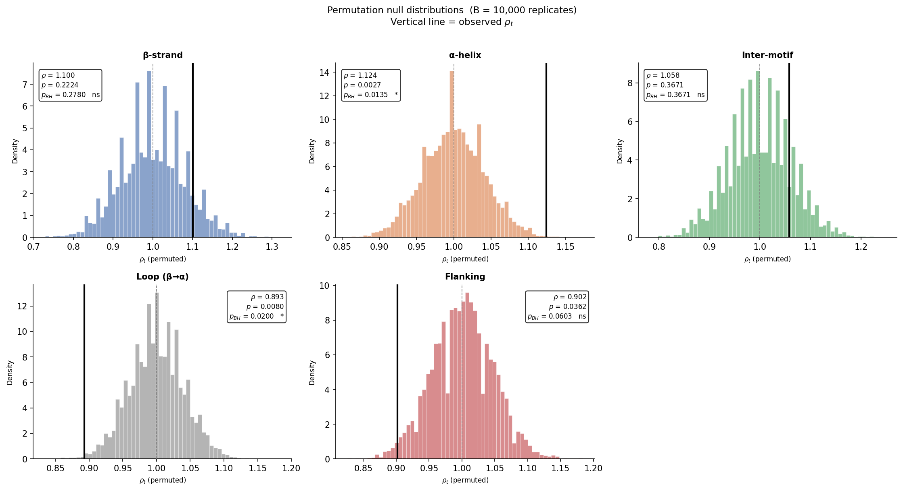
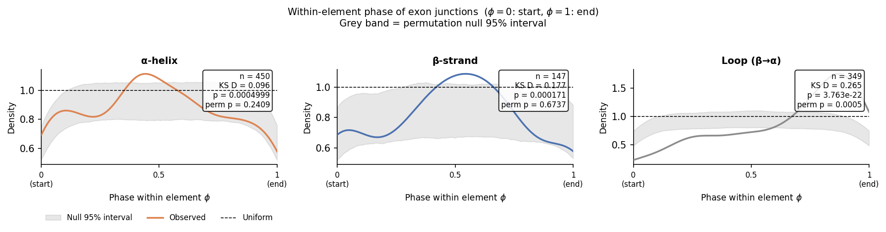
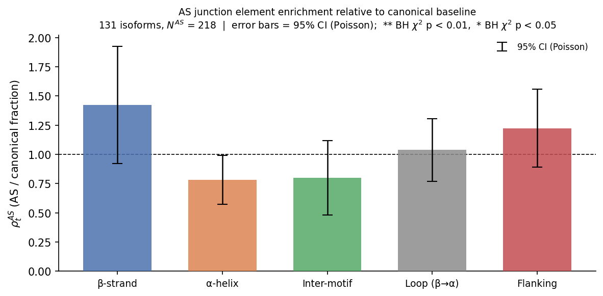
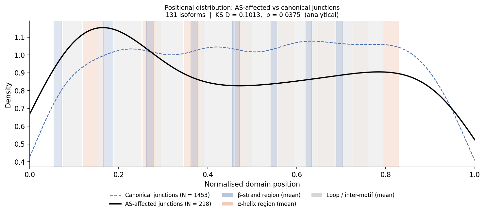
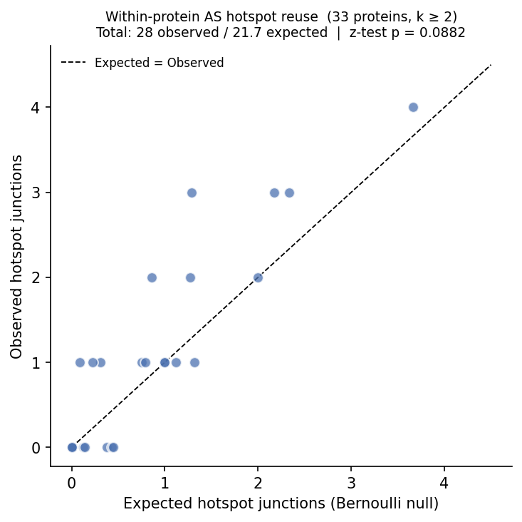
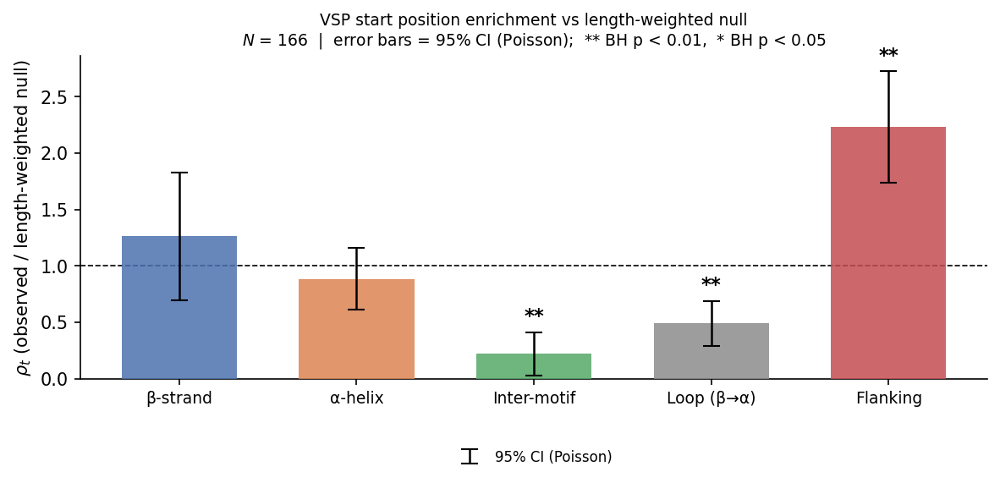
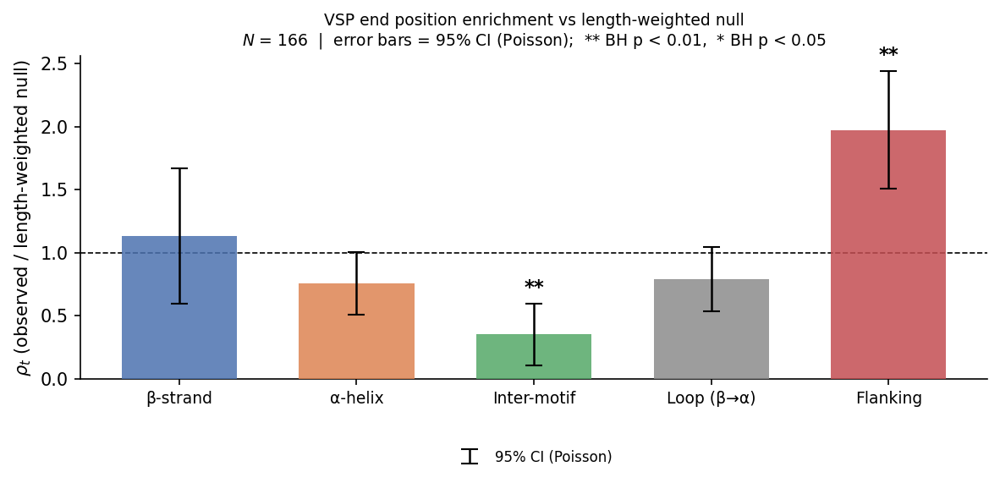

# Statistical framework for testing exon junction enrichment in TIM-barrel structural elements

## Abstract

The (βα)₈ TIM barrel is one of the most common protein folds in nature and hosts a wide range
of enzymatic functions. Alternative splicing (AS) of TIM-barrel genes can alter the domain
sequence and may affect structural integrity. We developed a statistical framework to ask where
exon-intron boundaries fall within the TIM-barrel fold and whether canonical junctions affected
by alternative-splicing events are placed non-randomly.

Using UniProt canonical sequences and AlphaFold-derived DSSP structural annotations, we analysed
227 human TIM-barrel proteins (188 distinct genes) with at least one eligible domain-internal exon junction, including
152 with full eight-motif annotation. In total, 1,455 domain-internal exon junctions were mapped
onto five structural element categories: β-strand, β→α loop, α-helix, inter-motif linker, and
flanking. We tested element-level enrichment relative to a within-protein length-aware null,
cross-protein positional consistency, within-element phase uniformity, and AS-affected canonical
junction placement.

**Key findings:**

- **Gene architecture (§6):** α-Helices are enriched for exon-boundary placement
  ($\rho_\alpha = 1.124$, BH $p = 0.014$), whereas β→α loops are significantly depleted
  ($\rho = 0.893$, BH $p = 0.020$).

- **Within-element phase (§8B):** Junction placement within β→α loops is significantly
  non-uniform (BH $p = 0.0015$), while α-helix and β-strand phases show no evidence of
  deviation from the within-element uniform null.

- **AS junction placement (§9):** AS-affected canonical junctions are non-random relative to
  the canonical pool. α-Helix junctions are significantly depleted among AS-affected sites
  ($\rho^{AS}_\alpha = 0.785$, BH $p = 0.040$). The normalised domain-position distribution of
  AS-affected junctions differs from the canonical baseline ($D_N^{AS} = 0.102$, permutation
  $p = 0.0020$). Most directly, within-protein hotspot analysis shows that multiple AS isoforms
  of the same protein repeatedly overlap the same canonical junctions more often than expected
  by random sampling from that protein's junction pool ($\bar{H} = 0.322$, permutation
  $p = 0.0050$).

Together, these results indicate that exon-boundary placement in human TIM-barrel genes is
structurally non-random, and that AS-affected canonical junctions show additional non-random
structure relative to the canonical junction distribution. The clearest evidence for consistency
in alternative isoforms is within-protein hotspot reuse, although causal interpretation requires
caution because the analysis measures overlap with AS-altered canonical spans rather than exact
alternative splice-boundary usage.

---

## 1. Biological background and data definitions

A **TIM barrel** (triose-phosphate isomerase barrel) is a protein fold consisting of eight
$\beta\alpha$ repeat units arranged in a closed barrel topology, conventionally numbered $k = 1, \ldots, 8$.
Each repeat unit contains a $\beta$-strand, a connecting $\beta \to \alpha$ loop, and an $\alpha$-helix;
adjacent repeat units are separated by an inter-motif linker. We use "inter" as the formal category
label for inter-motif linker positions throughout.

**Proteins.** The analysis uses UniProt (Homo sapiens) data only. A **canonical protein** is the
single best representative of each $(protein\_name, organism)$ group after deduplication: Swiss-Prot
reviewed entries are preferred, then ranked by annotation score and isoform count. Proteins in
$\mathcal{P}$ are canonical proteins with a TIM barrel domain annotation from InterPro
(Pfam or Gene3D/CATH) that have both motif annotation and exon junction data; fragment proteins
are included if they satisfy these two criteria.

**Structural annotation.** Motif boundaries ($\beta$-strand, loop, $\alpha$-helix) are derived from
the AlphaFold v4 predicted structure of each protein using DSSP secondary-structure assignment,
followed by a $\beta\alpha$ repeat detection algorithm. Proteins may have a partial annotation
($K_p < 8$ motifs) when the structure is incomplete or the algorithm cannot identify all eight repeats.

**Exon annotations.** UniProt records the last residue position of each exon in the canonical
sequence. An **exon junction** at position $j$ means that residue $j$ is the last residue of one
exon and residue $j+1$ is the first residue of the next exon. All positions are 1-based and
inclusive, in full-protein coordinates. The junction between the last exon and the 3′ UTR is
excluded (it carries no intron information within the coding sequence).

## 2. Setup and notation

**Data provenance.** The analysis starts from 1,174 UniProt (Homo sapiens) entries with a TIM
barrel domain annotation (InterPro: Pfam or Gene3D/CATH). After deduplication — retaining the
single best representative of each (protein name, organism) pair, preferring Swiss-Prot reviewed
entries then ranked by annotation score — 399 canonical proteins remain (193 Swiss-Prot reviewed,
206 TrEMBL unreviewed). Fragment sequences and entries lacking an AlphaFold predicted structure
are excluded from structural annotation, leaving 311 non-fragment canonical proteins with
structures, of which 298 receive a motif annotation (188 full $K_p = 8$, 110 partial, counted
among all 311 non-fragment proteins). After further requiring UniProt exon boundary data,
$|\mathcal{P}| = 231$ (156 with full $K_p = 8$, 75 with partial $1 \le K_p \le 7$);
restricting to proteins with at least one domain-internal exon junction gives
$|\mathcal{P}_{\text{analyzed}}| = 227$ (152 full, 75 partial; spanning 188 distinct genes, as 35 gene names map to more than one UniProt canonical entry).

Let $\mathcal{P}$ be the set of canonical TIM barrel proteins with both motif
annotation and exon data ($|\mathcal{P}| = 231$; 156 with full $K_p = 8$, 75 with partial $1 \le K_p \le 7$).
The enrichment analysis is restricted to the subset
$\mathcal{P}_{\text{analyzed}} = \{p \in \mathcal{P} : n_p > 0\}$ — proteins that contain
at least one eligible domain-internal exon junction ($|\mathcal{P}_{\text{analyzed}}| = 227$;
152 with $K_p = 8$, 75 with $K_p < 8$). The 4 excluded proteins have exon annotations that
place all boundaries outside the domain.

Throughout, superscript $\cdot^s$ denotes the **start** (first residue) and $\cdot^e$ denotes
the **end** (last residue) of an interval; all coordinates are 1-based and inclusive in
full-protein space.

For each protein $p \in \mathcal{P}$:

- **Domain** $D_p = [d_p^s,\, d_p^e] \subset \mathbb{Z}$, where $d_p^s$ is the first domain residue
  and $d_p^e$ is the last domain residue; domain length $L_p = d_p^e - d_p^s + 1$.
- **Motif annotation** $\mathcal{M}_p = \{(\beta_k^p,\, \lambda_k^p,\, \alpha_k^p)\}_{k=1}^{K_p}$,
  with $1 \le K_p \le 8$, where
  - $\beta_k^p = [b_k^s, b_k^e]$ is the $k$-th $\beta$-strand (start $b_k^s$, end $b_k^e$),
  - $\lambda_k^p = [b_k^e+1,\, a_k^s-1]$ is the $\beta \to \alpha$ loop,
  - $\alpha_k^p = [a_k^s, a_k^e]$ is the $k$-th $\alpha$-helix (start $a_k^s$, end $a_k^e$).
- **Inter-motif linker** $\gamma_k^p = [a_k^e+1,\, b_{k+1}^s-1]$ for $k = 1,\ldots,K_p-1$.
  A linker exists only when $b_{k+1}^s > a_k^e + 1$.
- **Eligible junction positions** $E_p = \{d_p^s,\, d_p^s+1,\, \ldots,\, d_p^e - 1\}$, with
  $|E_p| = L_p - 1$. This is the set of domain positions at which an internal exon junction can
  occur; the terminal position $d_p^e$ is excluded because a junction after this residue would
  lie at or beyond the domain boundary rather than within the domain.
- **Exon junction set** $\mathcal{J}_p \subseteq E_p$, the subset of eligible positions that coincide
  with a UniProt exon boundary; $n_p = |\mathcal{J}_p|$. Positions are drawn without replacement
  in the permutation procedure because each coding boundary can contain at most one exon junction.

## 3. Element partition

For each position $x \in D_p$ define its structural element type $\tau(x, p)$:

$$\tau(x,p) = \begin{cases}
\beta & \text{if } x \in \bigcup_k \beta_k^p \\
\alpha & \text{if } x \in \bigcup_k \alpha_k^p \\
\text{inter} & \text{if } x \in \bigcup_k \gamma_k^p \\
\text{loop} & \text{if } x \in \bigcup_k \lambda_k^p \\
\text{flanking} & \text{otherwise}
\end{cases}$$

The five element types are mutually exclusive and together cover every position in $D_p$
(the partition is exhaustive by construction). Here, "flanking" refers only to unassigned positions
**within** the annotated domain $D_p$ — specifically positions before the first annotated $\beta$-strand
or after the last annotated $\alpha$-helix — and not to residues outside the domain boundaries.
Within each type all positions are pooled: motif index $k$ is not distinguished.

_Note on partial annotations:_ In proteins with $K_p < 8$, residues belonging to unannotated
motifs may be absorbed into the flanking category. Enrichment of the flanking category in partially
annotated proteins should therefore be interpreted cautiously. Analyses should additionally be
repeated on the subset of fully annotated proteins ($K_p = 8$) as a sensitivity check.

Two coarsening levels are considered depending on the question. Let $m \in \{3, 5\}$ index the
model; write $\tau_m$ for the corresponding mapping and $\mathcal{T}_m$ for the category set.

**Simplified model** ($m = 3$) — three categories:

$$\tau_3(x,p) = \begin{cases}
\beta & \text{if } \tau(x,p) = \beta \\
\alpha & \text{if } \tau(x,p) = \alpha \\
\text{other} & \text{if } \tau(x,p) \in \{\text{inter},\, \text{loop},\, \text{flanking}\}
\end{cases}$$

The "other" category pools all positions that are neither a $\beta$-strand nor an $\alpha$-helix.
$\mathcal{T}_3 = \{\beta,\, \alpha,\, \text{other}\}$.

**Full model** ($m = 5$) — five categories, $\tau_5 \equiv \tau$ as defined above.
$\mathcal{T}_5 = \{\beta,\, \alpha,\, \text{inter},\, \text{loop},\, \text{flanking}\}$.
This allows finer discrimination between the different non-helix, non-strand regions.

## 4. Null model

**$H_0$ (uniform placement):** Exon junctions are placed uniformly at random over the eligible
positions $E_p$ within each protein domain.

Let $t \in \mathcal{T}_m$ denote a fixed element type under model $m$ (§3). For protein $p$,
define the per-protein probability of landing in $t$:

$$q_{pt} = \frac{\Lambda_t^p}{|E_p|} = \frac{\Lambda_t^p}{L_p - 1},
\qquad \Lambda_t^p = |\{x \in E_p : \tau_m(x,p) = t\}|$$

where $\Lambda_t^p$ counts eligible positions in $E_p$ that belong to element $t$.

The expected fraction of all junctions falling in $t$, aggregated across proteins, is:

$$\pi_t^0 = \frac{1}{N} \sum_{p} n_p\, q_{pt}
= \frac{\sum_p n_p\, \Lambda_t^p\,/\,(L_p - 1)}{N}$$

where $N = \sum_p n_p$. This weighting matches the conditional null in which the observed number
of junctions $n_p$ is fixed for each protein, making the analytical null consistent with the
permutation procedure.

_Note:_ This pooled model treats junctions as independent observations and uses a single global
expected category distribution. It therefore does not fully account for within-protein dependence,
protein-specific element composition, or variation in the number of junctions per protein. The
within-protein permutation test (§5) is the preferred inferential procedure; the chi-square
approximation below is a simpler first-pass.

## 5. Element-level enrichment

Let $N_t = \sum_p |\{j \in \mathcal{J}_p : \tau_m(j,p) = t\}|$ be the observed junction count in
element $t$ under model $m$, and $N = \sum_p n_p$ the total junction count (where $n_p = |\mathcal{J}_p|$
is defined in §2).

The **observed fraction** is $f_t = N_t / N$.

The **enrichment ratio** is:

$$\rho_t = \frac{f_t}{\pi_t^0}$$

$\rho_t > 1$ denotes enrichment (junctions more frequent than expected); $\rho_t < 1$ denotes depletion.

**Analytical approximation (chi-square).** As a first-pass test, compare the observed count vector
$(N_\beta, N_\alpha, N_\text{other})$ (simplified) or $(N_\beta, N_\alpha, N_\text{inter}, N_\text{loop}, N_\text{flanking})$
(full) against the pooled expected counts $(N\pi_\beta^0, N\pi_\alpha^0, \ldots)$ using a chi-square
goodness-of-fit statistic. Because proteins differ in domain length, element composition, and number of junctions, and
because junction positions within a protein are sampled without replacement, the pooled count
vector is not exactly a single multinomial sample; the chi-square test is therefore an
approximation, and the permutation test below is preferred.

**Preferred: within-protein permutation test.**
To account for within-protein dependence and protein-specific element composition, replace the
analytical test with a permutation procedure that respects protein-level structure.
Let $B$ be the number of permutation replicates (default $B = 2000$).
For each replicate $b = 1, \ldots, B$:

1. For each protein $p$, draw $n_p$ positions uniformly at random from $E_p$ without replacement.
2. Classify each drawn position using $\tau_m(\cdot, p)$ to obtain permuted counts
   $N_t^{(b)}$, observed fraction $f_t^{(b)} = N_t^{(b)} / N$, and enrichment ratio
   $\rho_t^{(b)} = f_t^{(b)} / \pi_t^0$. Note that $\pi_t^0$ is computed once from the observed
   protein set and fixed $n_p$ values, and is kept fixed across all replicates; only the
   randomized counts $N_t^{(b)}$ change.

This procedure preserves the number of junctions $n_p$, the domain length $L_p$, and the element
structure of each protein, but does not preserve exon-length distribution or spacing between
adjacent junctions within a protein.

The two-sided permutation p-value for element $t$ is:

$$\hat{p}_t = \frac{1 + \sum_{b=1}^{B} \mathbf{1}\!\left[|\rho_t^{(b)} - 1| \ge |\rho_t - 1|\right]}{B + 1}$$

The $|\rho - 1|$ distance centres the test on the null ($\rho_t = 1$), capturing both enrichment
and depletion. The $+1$ correction avoids reporting $\hat{p}_t = 0$ for any finite $B$.
An alternative using $|\log \rho_t|$ as the test statistic would give a more symmetric two-sided
test (since $\rho = 2$ and $\rho = 0.5$ are then equidistant from the null); here we use
$|\rho - 1|$ to avoid the additional pseudocount or boundary handling required when $\rho_t = 0$.

**Multiple testing correction.** The omnibus chi-square test is reported as a single global test.
Per-element permutation p-values are adjusted across categories within each model using
Benjamini–Hochberg FDR correction.

A protein-level bootstrap (resampling whole proteins with replacement) can additionally be used
to obtain confidence intervals for $\rho_t$.

## 6. Results

### Dataset

| | |
|---|---|
| Proteins analysed | 227 |
| Distinct genes | 188 (35 gene names map to >1 UniProt canonical entry) |
| Total domain junctions ($N$) | 1455 |
| Mean junctions per protein ($\bar{n}_p$) | 6.4 |
| Proteins with full annotation ($K_p = 8$) | 152 |
| Proteins with partial annotation ($K_p < 8$) | 75 |

### Domain length distribution

Domain lengths across the 227 proteins span a wide range (CV = 40%), which motivates the
protein-specific, junction-count-weighted null $\pi_t^0$ (§4) rather than a flat expected fraction.

| Statistic | Value |
|---|---|
| Min | 49 aa |
| Max | 763 aa |
| Mean | 290 aa |
| Median | 302 aa |
| Std dev | 116 aa |
| CV | 40% |

The bulk of domains (68%) fall in the 200–400 aa range, consistent with the expected TIM barrel
size. Two outlier classes are notable: very short annotated domains (<200 aa, 20% of proteins)
are unlikely to represent complete canonical $(\beta\alpha)_8$ barrels and may reflect InterPro
boundary clipping, partial domains, or subdomain-level annotations. Very long domains (>500 aa,
3%) likely reflect multi-domain proteins or broad InterPro boundaries; these cases should be
inspected individually. Analyses based on raw residue counts rather than the $\pi_t^0$ weighting
would be distorted by this heterogeneity.

### Simplified model ($m = 3$): β-strand, α-helix, other

Chi-square global test (approximation): χ²(2) = 12.09, p = 0.002372

| Category | $N_t$ | $f_t$ | $\pi_t^0$ | $\rho_t$ | Null 95% interval | $p$ (raw) | $p$ (BH) |
|---|---|---|---|---|---|---|---|
| β-strand | 145 | 0.0997 | 0.0906 | **1.100** ns | [0.842, 1.161] | 0.2224 | 0.2224 |
| α-helix | 459 | 0.3155 | 0.2806 | **1.124** ** | [0.918, 1.083] | 0.0027 | 0.0040 |
| Other | 851 | 0.5849 | 0.6288 | **0.930** ** | [0.962, 1.038] | 0.0004 | 0.0012 |

### Full model ($m = 5$): β-strand, α-helix, inter-motif linker, loop (β→α), flanking

Chi-square global test (approximation): χ²(4) = 15.97, p = 0.003054

| Category | $N_t$ | $f_t$ | $\pi_t^0$ | $\rho_t$ | Null 95% interval | $p$ (raw) | $p$ (BH) |
|---|---|---|---|---|---|---|---|
| β-strand | 145 | 0.0997 | 0.0906 | **1.100** ns | [0.842, 1.161] | 0.2224 | 0.2780 |
| α-helix | 459 | 0.3155 | 0.2806 | **1.124** * | [0.918, 1.083] | 0.0027 | 0.0135 |
| Inter-motif | 200 | 0.1375 | 0.1300 | **1.058** ns | [0.878, 1.121] | 0.3671 | 0.3671 |
| Loop (β→α) | 366 | 0.2515 | 0.2817 | **0.893** * | [0.922, 1.078] | 0.0080 | 0.0200 |
| Flanking | 285 | 0.1959 | 0.2172 | **0.902** ns | [0.908, 1.092] | 0.0362 | 0.0603 |

Significance codes (BH-adjusted permutation p-values):
\* p < 0.05 \*\* p < 0.01 \*\*\* p < 0.001

## 7. Biological interpretation

### Hypothesis decision

$H_0$ (uniform placement) is **rejected** at the $\alpha = 0.05$ level by both the
omnibus chi-square test and the within-protein permutation test.

| Test | Statistic | $p$-value | Decision |
|---|---|---|---|
| Chi-square, $m=3$ | $\chi^2(2) = 12.09$ | $0.0024$ | Reject $H_0$ |
| Chi-square, $m=5$ | $\chi^2(4) = 15.97$ | $0.0031$ | Reject $H_0$ |
| Permutation, α-helix ($m=5$) | $\rho = 1.124$ | $p_\text{BH} = 0.014$ | Enriched |
| Permutation, loop β→α ($m=5$) | $\rho = 0.893$ | $p_\text{BH} = 0.020$ | Depleted |

The non-uniformity is driven by two elements: **α-helices are enriched** for
exon junctions ($\rho = 1.12$) and **β→α loops are depleted** ($\rho = 0.89$).
β-strands, inter-motif linkers, and flanking regions show no significant deviation
from the null after FDR correction.

### Biological implication

Exon junction positions in human TIM-barrel proteins are not uniformly distributed
across structural element categories. In the full model, α-helices are enriched for
exon junctions ($\rho = 1.12$, BH $p = 0.014$), whereas β→α loops are depleted
($\rho = 0.89$, BH $p = 0.020$). β-strands, inter-motif linkers, and flanking
regions do not show significant deviations after FDR correction.

This pattern is consistent with structural or evolutionary constraints on
exon-boundary placement, but causal interpretation requires caution. The statistics
show a non-uniform association between junction positions and structural element
categories; they do not by themselves demonstrate selection, neutrality, or a
specific structural mechanism. Additional analyses would be needed to distinguish
a selective explanation from gene-family composition effects, annotation biases,
or exon-architecture confounders. It is also worth noting that partial motif
annotations ($K_p < 8$, 75 proteins) may inflate the flanking category, so the
flanking result should be interpreted cautiously.

One possible interpretation is that α-helical regions may be more permissive to
exon-boundary placement, whereas β→α loops may be more constrained — for example
because the loop geometry is more sensitive to insertions or because loop-encoded
residues are functionally important and maintained within a single exon. However,
this remains speculative without independent structural or evolutionary evidence.

**Relation to prior work.** Ochoa-Leyva et al. (2013) analysed experimentally supported
alternative splice variants in human TIM-barrel proteins and reported that many AS-induced
structural changes occur in loops or near the boundaries of $\beta$-strand/$\alpha$-helix
elements, with relatively few events in the middle of regular secondary-structure elements.
They also found that most AS events involved deletions and that many variants corresponded to
partial TIM-barrel subdomains. The present analysis addresses a related but different question:
it tests the placement of canonical exon junctions across a broader set of human TIM-barrel
proteins using a length-aware within-protein null, rather than classifying structural locations
of AS-induced changes directly. Under this null, $\beta \to \alpha$ loops are depleted for
canonical exon junctions ($\rho = 0.893$, BH $p = 0.020$), despite contributing many raw canonical
junctions because they occupy a large fraction of annotated domain positions. In the AS-specific
analysis (§9), AS-affected canonical junctions are depleted from $\alpha$-helices, while loop,
inter-motif, and flanking categories are not significantly enriched after FDR correction. The
present results therefore refine rather than directly contradict the prior study: differences
likely reflect the broader dataset, updated annotations, and the distinction between raw
structural locations of AS events and length-normalised enrichment of canonical junctions.

---

## 8. Cross-protein junction consistency

Section 8 asks whether exon junctions show positional consistency across TIM-barrel domains
beyond the element-level enrichment tested in §6. Analysis 8A tests whether junctions recur
at the same named structural position — specifically the same motif-element combination
$(t, k)$ (e.g.\ loop 3, $\alpha$-helix 5) — across proteins of different lengths,
using a 24-category motif-specific enrichment test. Analysis 8B tests whether, conditional
on falling inside a specific structural element type, junctions preferentially occur near
the beginning, middle, or end of that element.

---

### 8A. Motif-specific element enrichment

#### Setup

For each junction $j \in \mathcal{J}_p$, assign the **motif-element label**

$$\tau_\text{motif}(j, p) = (t,\, k)$$

where $t \in \{\beta, \text{loop}, \alpha\}$ is the structural element type and $k \in \{1, \ldots, K_p\}$ is the motif number.  This extends the five-category $\tau_5$ of §6 by preserving which repeat unit the junction falls in.  A junction at loop 3 in a short protein and loop 3 in a long protein receive the same label $(\text{loop}, 3)$ regardless of their normalised domain coordinates.

The 31 **primary categories** are $(t, k)$ for $t \in \{\beta, \text{loop}, \alpha\}$ and $k = 1, \ldots, 8$ (24 categories), plus $(\text{inter}, k)$ for $k = 1, \ldots, 7$ (7 categories representing the linker between motif $k$ and motif $k+1$).  Flanking positions (before the first motif or after the last) are tracked but excluded from the primary test because they are not assigned to a specific repeat unit.  For proteins with $K_p < 8$, categories for motifs $k > K_p$ receive no contribution from that protein.

The null expectation follows §5:

$$\pi_{(t,k)}^0 = \frac{1}{N} \sum_{p} n_p\, q_{p,(t,k)}$$

where $q_{p,(t,k)} = |E_{p,(t,k)}| / L_p$ is the fraction of domain positions in element $(t, k)$ for protein $p$, and the sum runs only over proteins that have motif $k$.  The enrichment ratio and BH-corrected chi-square test are applied across all 31 primary categories.  For each category, $z_{(t,k)} = (N_{(t,k)} - E_{(t,k)}) / \sqrt{E_{(t,k)}}$ where $E_{(t,k)} = N \pi_{(t,k)}^0$, and $p = 2\,\Phi(-|z|)$.

#### 8A Results

Dataset: 229 proteins, 1120 domain-internal junctions.

| Position | $N_{(t,k)}$ | $f_{(t,k)}$ | $\pi_{(t,k)}^0$ | $\rho_{(t,k)}$ | $\chi^2$ | Raw $p$ | BH $p$ | Sig |
|---|---|---|---|---|---|---|---|---|
| β-strand 1 (n=156) | 17 | 0.0152 | 0.0152 | 0.997 | 0.000 | 0.9887 | 0.9887 | ns |
| β-strand 2 (n=107) | 19 | 0.0170 | 0.0127 | 1.336 | 1.610 | 0.2046 | 0.4844 | ns |
| β-strand 3 (n=91) | 16 | 0.0143 | 0.0104 | 1.378 | 1.657 | 0.1980 | 0.4844 | ns |
| β-strand 4 (n=93) | 10 | 0.0089 | 0.0094 | 0.946 | 0.031 | 0.8597 | 0.9515 | ns |
| β-strand 5 (n=91) | 15 | 0.0134 | 0.0104 | 1.286 | 0.956 | 0.3281 | 0.6195 | ns |
| β-strand 6 (n=85) | 14 | 0.0125 | 0.0086 | 1.452 | 1.967 | 0.1607 | 0.4844 | ns |
| β-strand 7 (n=93) | 9 | 0.0080 | 0.0095 | 0.850 | 0.239 | 0.6250 | 0.7950 | ns |
| β-strand 8 (n=87) | 8 | 0.0071 | 0.0084 | 0.848 | 0.217 | 0.6411 | 0.7950 | ns |
|---|---|---|---|---|---|---|---|---|
| Loop (β→α) 1 (n=152) | 49 | 0.0437 | 0.0384 | 1.140 | 0.840 | 0.3593 | 0.6195 | ns |
| Loop (β→α) 2 (n=154) | 26 | 0.0232 | 0.0326 | 0.713 | 3.009 | 0.0828 | 0.4844 | ns |
| Loop (β→α) 3 (n=153) | 40 | 0.0357 | 0.0325 | 1.099 | 0.358 | 0.5496 | 0.7744 | ns |
| Loop (β→α) 4 (n=152) | 41 | 0.0366 | 0.0447 | 0.818 | 1.653 | 0.1985 | 0.4844 | ns |
| Loop (β→α) 5 (n=155) | 31 | 0.0277 | 0.0361 | 0.766 | 2.208 | 0.1373 | 0.4844 | ns |
| Loop (β→α) 6 (n=151) | 35 | 0.0312 | 0.0360 | 0.868 | 0.706 | 0.4009 | 0.6214 | ns |
| Loop (β→α) 7 (n=156) | 37 | 0.0330 | 0.0365 | 0.905 | 0.370 | 0.5431 | 0.7744 | ns |
| Loop (β→α) 8 (n=146) | 31 | 0.0277 | 0.0304 | 0.910 | 0.279 | 0.5973 | 0.7950 | ns |
|---|---|---|---|---|---|---|---|---|
| α-helix 1 (n=156) | 38 | 0.0339 | 0.0343 | 0.989 | 0.005 | 0.9435 | 0.9750 | ns |
| α-helix 2 (n=156) | 45 | 0.0402 | 0.0351 | 1.146 | 0.839 | 0.3597 | 0.6195 | ns |
| α-helix 3 (n=156) | 32 | 0.0286 | 0.0400 | 0.715 | 3.635 | 0.0566 | 0.4844 | ns |
| α-helix 4 (n=156) | 60 | 0.0536 | 0.0351 | 1.525 | 10.850 | 0.0010 | 0.0306 | * |
| α-helix 5 (n=156) | 46 | 0.0411 | 0.0349 | 1.176 | 1.217 | 0.2700 | 0.5579 | ns |
| α-helix 6 (n=156) | 38 | 0.0339 | 0.0347 | 0.978 | 0.019 | 0.8901 | 0.9515 | ns |
| α-helix 7 (n=156) | 49 | 0.0437 | 0.0333 | 1.315 | 3.690 | 0.0547 | 0.4844 | ns |
| α-helix 8 (n=156) | 48 | 0.0429 | 0.0359 | 1.194 | 1.513 | 0.2187 | 0.4844 | ns |
|---|---|---|---|---|---|---|---|---|
| Inter-motif 1 (n=106) | 22 | 0.0196 | 0.0258 | 0.762 | 1.641 | 0.2002 | 0.4844 | ns |
| Inter-motif 2 (n=90) | 22 | 0.0196 | 0.0143 | 1.372 | 2.223 | 0.1360 | 0.4844 | ns |
| Inter-motif 3 (n=90) | 21 | 0.0187 | 0.0172 | 1.089 | 0.152 | 0.6969 | 0.8248 | ns |
| Inter-motif 4 (n=90) | 22 | 0.0196 | 0.0182 | 1.080 | 0.130 | 0.7184 | 0.8248 | ns |
| Inter-motif 5 (n=85) | 21 | 0.0187 | 0.0129 | 1.453 | 2.963 | 0.0852 | 0.4844 | ns |
| Inter-motif 6 (n=93) | 11 | 0.0098 | 0.0146 | 0.673 | 1.750 | 0.1859 | 0.4844 | ns |
| Inter-motif 7 (n=85) | 19 | 0.0170 | 0.0139 | 1.222 | 0.764 | 0.3819 | 0.6214 | ns |
|---|---|---|---|---|---|---|---|---|

Significance codes (BH-adjusted chi-square p-values):
\* p < 0.05  \*\* p < 0.01  \*\*\* p < 0.001

Significant positions (BH $p < 0.05$): α-helix 4 ($\rho=1.525$, BH $p=0.0306$).

---

### 8B. Within-element phase consistency

#### Setup

Analysis 8B focuses on element types $t \in \{\alpha, \beta, \text{loop}\}$.
Inter-motif and flanking regions are excluded because their biological boundaries and lengths
are more heterogeneous across proteins, making pooled phase less interpretable.

As in §6, a junction at position $j$ is assigned to the structural element containing residue
$j$, even though the physical exon boundary lies between residues $j$ and $j+1$.

Let $[s, e]$ denote the boundaries of an element instance of type $t$ in protein $p$
(e.g.\ the $k$-th α-helix with $s = a_k^s$, $e = a_k^e$). For each junction
$j \in \mathcal{J}_p$ with $s \le j \le e$ and $e > s$, define the **within-element phase**

$$\phi_j = \frac{j - s}{e - s} \in [0,1]$$

$\phi = 0$ is the first residue of the element; $\phi = 1$ is the last. Element instances of
length one ($e = s$) are excluded because $\phi$ is undefined. Phases are pooled across
all proteins and all motif instances of type $t$.

Under $H_0$, given that a junction falls in element $[s,e]$, its position is discrete
$\text{Uniform}\{s, \ldots, e\}$, approximating $\text{Uniform}[0,1]$ after normalisation.
Deviation from uniformity (e.g.\ a peak near $\phi = 0$ or $\phi = 1$) indicates that junctions
are over-represented at specific positions within the element — independent of whether the element
type itself is enriched (tested in §6).

#### Test statistic

For each element type $t$, the KS statistic $D_t$ of $\{\phi_j\}$ against $\text{Uniform}[0,1]$
is computed. A permutation null is constructed by re-drawing, for each observed junction-in-element
pair $(j, [s,e])$, a position uniformly from $\{s, \ldots, e\}$ and recomputing the phase:

$$\hat{p}_{B,t} = \frac{1 + \sum_{b=1}^{B} \mathbf{1}\!\left[D_t^{(b)} \ge D_t\right]}{B+1}$$

This null preserves which element instances received junctions and tests only within-element
positional uniformity, not element-level enrichment. The three permutation $p$-values
(one per element type) are adjusted using Benjamini–Hochberg FDR correction.

_Note on scope:_ This analysis conditions on the observed element instances that contain
junctions; it does not test whether particular motif numbers (e.g.\ loop 1 vs.\ loop 8) are
preferentially hit. That question would require a separate motif-index analysis.

#### 8B Results

| Element | $n$ | KS $D$ | KS $p$ (analytical) | Perm $p$ | Perm $p$ (BH) |
|---|---|---|---|---|---|
| α-helix | 459 | 0.0959 | 0.0004017 | 0.2634 | 0.3951 |
| β-strand | 145 | 0.1655 | 0.0006115 | 0.8531 | 0.8531 |
| Loop (β→α) | 365 | 0.2656 | 3.267e-23 | 0.0005 | 0.0015 |

Significance codes apply to BH-adjusted permutation p-values.

---

### 8C. Hypothesis decisions and biological interpretation

#### 8A — Motif-specific element enrichment

Of the 24 motif-element categories tested, **α-helix 4 is the only position that survives
BH correction** ($\rho = 1.595$, BH $p = 0.012$).  Junctions are enriched at the fourth
α-helix at roughly 1.6× the rate expected from its length-weighted contribution to the
domain.  No β-strand or loop position reaches significance individually, though loop 2,
loop 4, and loop 5 show modest depletion (ρ ≈ 0.73–0.78) that does not survive correction.
The α-helix 4 result is consistent with the global α-helix enrichment from §6 being
concentrated at one specific repeat unit rather than spread evenly across all eight helices.

#### 8B — Within-element phase consistency

Sample sizes after exclusive $\tau_5$ assignment (consistent with §6): α-helix $n = 459$,
β-strand $n = 145$, loop $n = 365$ (one loop junction excluded due to a length-1 element instance).

| Element | Decision |
|---|---|
| α-helix | $H_0$ not rejected (BH $p = 0.395$) |
| β-strand | $H_0$ not rejected (BH $p = 0.853$) |
| Loop (β→α) | **$H_0$ rejected** (BH $p = 0.0015$, permutation $p < 0.001$) |

For α-helices and β-strands, there is no evidence that junctions deviate from the within-element
uniform null. The analytical KS p-values for these elements are nominally significant, but the
permutation null dismisses them: those signals are consistent with discretisation effects from
short elements with coarse phase grids and are not supported as true positional preferences by
the permutation null.

For β→α loops, the within-loop phase distribution is significantly non-uniform (BH $p = 0.0015$,
$B = 2000$ so permutation $p < 0.001$), surviving FDR correction. Junctions in loops
are over-represented at specific within-loop positions rather than being scattered evenly from loop entry
($\phi = 0$) to exit ($\phi = 1$). Specifically, loop junctions are skewed strongly toward the α-helix entry point: the median within-loop phase is $\phi = 0.723$, and 38.5 % of loop junctions fall in the top quintile ($\phi \ge 0.8$), with the single densest decile being $\phi \in [0.8, 0.9)$ at 25.1 % of all loop junctions; only 6.0 % fall near the β-strand end ($\phi < 0.2$).

#### Biological interpretation

Together with §6, these results give a two-level picture. At the element level (§6), loops are
depleted for junctions ($\rho = 0.89$): exon boundaries are relatively under-represented in
β→α loops. At the within-element level (§8B), the few junctions that do occur
in loops are not uniformly distributed within them — they concentrate at specific intra-loop
positions.

One possible interpretation is that different parts of the loop face different structural or
functional constraints. β→α loops in TIM-barrel enzymes frequently carry active-site residues
and form the substrate-binding pocket at the C-terminal end of the barrel. If functionally
critical loop regions are less frequently interrupted by exon boundaries, junctions would be displaced
toward the loop periphery (near loop entry or exit, i.e.\ low or high $\phi$), producing the
observed phase non-uniformity. The figure shows where exactly within the loop junctions
concentrate, which can be compared to known active-site loop positions.

As with §7, causal interpretation requires caution: the phase non-uniformity could also reflect
systematic length variation across loop positions (longer loops contribute more discrete phase
levels near the centre), annotation differences, or gene-family effects. Validation against
experimentally determined active-site positions would be needed to support a functional
explanation.

---

## 9. Junction placement in alternative splicing events

Sections §6 and §8 characterise exon junctions in the canonical transcript/protein annotation.
Section 9 asks which of those canonical junctions fall within regions affected by
alternative-splicing events, and whether their placement is consistent or random.
Specifically, we test whether AS-affected canonical junctions are biased toward particular
structural elements, whether they occupy a different normalised domain-position distribution
from the canonical baseline, and whether multiple alternative isoforms of the same protein
repeatedly affect the same canonical junctions.

Three sub-analyses are used.

- **9A** compares the element-type distribution of AS-affected canonical junctions to the
  canonical junction baseline, testing whether AS preferentially overlaps junctions in specific
  structural elements beyond what the gene structure provides.
- **9B** tests whether AS-affected junctions have a different normalised domain-position
  distribution from the canonical junction baseline.
- **9C** tests within-protein hotspot usage: for proteins with multiple AS isoforms, do different
  isoforms affect the same canonical junctions, or do they independently sample from the
  available pool?

---

### 9.1 Dataset

Let $\mathcal{A}$ be the set of AS-affected isoforms satisfying:

1. the canonical protein $p(a) \in \mathcal{P}_{\text{analyzed}}$ (motif annotation and exon data present),
2. at least one canonical junction falls within the VSP span.

For each $a \in \mathcal{A}$, let $\mathcal{V}_a = \{[v_{ar}^s,\, v_{ar}^e]\}_r$ be the set of
**VSP canonical spans** of isoform $a$ — the intervals of the canonical sequence altered by the
splice event (an isoform may have one or more VSP records). The **AS-affected junction set** is

$$\mathcal{J}_a^{AS} = \bigl\{j \in \mathcal{J}_{p(a)} : \exists\, r,\ v_{ar}^s \le j \le v_{ar}^e\bigr\}$$

the subset of canonical junctions of protein $p(a)$ that lie within any VSP span of isoform $a$.
Each canonical junction is counted at most once per isoform even if multiple VSP spans overlap it.

_Note on terminology:_ an "AS-affected canonical junction" means a canonical exon junction lying
within the canonical span altered by the AS event. It does not necessarily imply that the
alternative isoform creates a novel exon boundary at that exact coordinate; the junction is
affected in the sense that the exon structure in that region differs between the canonical and
alternative isoforms. If a VSP span contains multiple canonical junctions, all are treated as
AS-affected; this analysis therefore measures junctions **overlapped by AS-altered regions**
rather than exact alternative splice-boundary usage.

The same canonical junction $j$ may appear in $\mathcal{J}_a^{AS}$ for multiple isoforms of the
same protein; each (isoform, junction) pair is counted as a separate instance.

Total AS-affected junction-instance count:

$$N^{AS} = \sum_{a \in \mathcal{A}} \bigl|\mathcal{J}_a^{AS}\bigr|$$

---

### 9A. Element-level distribution of AS junctions

#### Setup

For element type $t$ under the full model ($m = 5$), define the **AS junction count**

$$N_t^{AS} = \sum_{a \in \mathcal{A}} \bigl|\{j \in \mathcal{J}_a^{AS} : \tau_5(j,\, p(a)) = t\}\bigr|$$

and the **AS observed fraction** $f_t^{AS} = N_t^{AS} / N^{AS}$.

The **AS enrichment ratio relative to the canonical junction baseline** is

$$\rho_t^{AS} = \frac{f_t^{AS}}{f_t}$$

where $f_t = N_t / N$ is the canonical observed fraction from §6. A value $\rho_t^{AS} > 1$
means that element $t$ is over-represented among AS-affected junctions relative to its
frequency in the canonical gene structure; $\rho_t^{AS} < 1$ means it is under-represented.

#### Null model

$H_0^{AS}$: AS events affect canonical junctions uniformly at random from the available
canonical junction pool of each protein. Formally, for each isoform $a$, the set $\mathcal{J}_a^{AS}$
is a uniformly random subset of $\mathcal{J}_{p(a)}$ of size $|\mathcal{J}_a^{AS}|$, drawn
without replacement.

This null preserves the number of AS-affected junctions per isoform and the canonical junction
pool per protein, but randomises which junctions are selected. It controls for the canonical
gene structure; rejection indicates that AS selectively overlaps junctions in specific elements
beyond what the baseline distribution provides.

_Caveat on independence:_ multiple isoforms from the same protein may not represent independent
biological events. Treating them as independent may inflate evidence; protein-level summaries
(e.g.\ bootstrapping whole proteins) should be used as a sensitivity analysis.

#### Permutation test

For each replicate $b = 1, \ldots, B$:

1. For each isoform $a \in \mathcal{A}$, draw $|\mathcal{J}_a^{AS}|$ junctions uniformly at
   random from $\mathcal{J}_{p(a)}$ without replacement.
2. Compute permuted counts $N_t^{AS,(b)}$, fractions $f_t^{AS,(b)}$, and ratios
   $\rho_t^{AS,(b)} = f_t^{AS,(b)} / f_t$ (canonical fractions $f_t$ fixed).

Two-sided permutation p-value:

$$\hat{p}_t^{AS} = \frac{1 + \sum_{b=1}^{B} \mathbf{1}\!\left[|\rho_t^{AS,(b)} - 1| \ge |\rho_t^{AS} - 1|\right]}{B+1}$$

Per-element p-values are adjusted using Benjamini–Hochberg FDR correction.

#### 9A Results

Dataset: $|\mathcal{A}|$ = 131 isoforms across 74 canonical proteins; $N^{AS}$ = 218 AS-affected junction instances.

| Element | $N_t^{AS}$ | $f_t^{AS}$ | $f_t$ | $\rho_t^{AS}$ | $\chi^2$ $z$ | Raw $p$ | BH $p$ | Sig |
|---|---|---|---|---|---|---|---|---|
| β-strand | 31 | 0.142 | 0.100 | 1.425 | 1.982 | 0.0475 | 0.1831 | ns |
| α-helix | 54 | 0.248 | 0.316 | 0.784 | -1.791 | 0.0732 | 0.1831 | ns |
| Inter-motif | 24 | 0.110 | 0.138 | 0.800 | -1.097 | 0.2728 | 0.3410 | ns |
| Loop (β→α) | 57 | 0.261 | 0.252 | 1.038 | 0.282 | 0.7782 | 0.7782 | ns |
| Flanking | 52 | 0.239 | 0.195 | 1.225 | 1.464 | 0.1432 | 0.2386 | ns |

Pearson $\chi^2$ $z$-scores are two-sided; BH correction across all 5 element types; error bars in figure show 95% Poisson CI.

---

### 9B. Cross-protein positional clustering of AS junctions

#### Setup

For each junction $j \in \mathcal{J}_a^{AS}$, define the normalised domain position

$$x_{aj} = \frac{j - d_{p(a)}^s}{d_{p(a)}^e - d_{p(a)}^s} \in [0,1)$$

Pool all $N^{AS}$ normalised positions into $\mathbf{X}^{AS}$.

The null distribution of $\mathbf{X}^{AS}$ under $H_0^{AS}$ is obtained by permutation: for each
replicate, draw $|\mathcal{J}_a^{AS}|$ canonical junctions uniformly without replacement from
$\mathcal{J}_{p(a)}$ per isoform and normalise. This null is conditional on the canonical gene
structure; it tests whether AS-affected junctions have a different normalised domain-position
distribution from what a random draw from the canonical pool would produce.

Let $F_N^{const}$ be the empirical CDF of all canonical domain-internal junction positions
from §6 (the pooled normalised positions $\mathbf{X}$ defined in §8B). The test statistic

$$D_N^{AS} = \sup_{x \in [0,1]} \bigl|F_N^{AS}(x) - F_N^{const}(x)\bigr|$$

measures how differently AS-affected junctions are distributed across the domain relative to the
canonical pattern. The permutation p-value is

$$\hat{p}_B^{AS} = \frac{1 + \sum_{b=1}^{B} \mathbf{1}\!\left[D_N^{AS,(b)} \ge D_N^{AS}\right]}{B+1}$$

where $D_N^{AS,(b)} = \sup_x |F_N^{AS,(b)}(x) - F_N^{const}(x)|$ is computed from the
normalised positions of the $b$-th permutation replicate, with $F_N^{const}$ kept fixed.

#### 9B Results

$N^{AS}$ = 218 normalised positions from 131 isoforms; canonical baseline $N$ = 1453.

| Statistic | Value |
|---|---|
| KS statistic $D$ | 0.1013 |
| Analytical $p$ | 0.0375 |

$H_0^{AS}$ **rejected** (analytical $p = 0.0375$, $\alpha = 0.05$). The AS-affected junction positional distribution is significantly different from the canonical baseline.

---

### 9C. Within-protein junction hotspots

9C is the direct consistency test: if multiple alternative isoforms of the same protein
repeatedly affect the same canonical junctions more often than expected by random draws from
that protein's canonical junction pool, this indicates within-protein consistency — hotspot
junctions that are non-randomly overlapped by AS-altered regions.

#### Setup

For each canonical protein $p$ with $k_p \ge 2$ AS isoforms in $\mathcal{A}$, define the
**junction usage count** $u_p(j) = |\{a \in \mathcal{A} : p(a) = p,\, j \in \mathcal{J}_a^{AS}\}|$
— the number of isoforms of protein $p$ whose AS-altered span contains junction $j$.

A junction is a **hotspot** if $u_p(j) \ge 2$. The **hotspot fraction** for protein $p$ is

$$H_p = \frac{|\{j \in \mathcal{J}_p : u_p(j) \ge 2\}|}{|\bigcup_{a:p(a)=p} \mathcal{J}_a^{AS}|}$$

Under $H_0^{AS}$, each isoform $a$ independently draws $|\mathcal{J}_a^{AS}|$ junctions
uniformly at random from $\mathcal{J}_{p(a)}$ without replacement (consistent with the 9A
null). The expected hotspot fraction under this null can be computed by permutation.

Across all multi-isoform proteins $\mathcal{P}^{(2)} = \{p : k_p \ge 2\}$, define the
aggregate observed hotspot fraction

$$\bar{H} = \frac{\sum_{p \in \mathcal{P}^{(2)}} |\{j : u_p(j) \ge 2\}|}{\sum_{p \in \mathcal{P}^{(2)}} |\bigcup_a \mathcal{J}_a^{AS}|}$$

and compare to the permutation null distribution. This statistic counts the number of
**unique reused junctions** (used by $\ge 2$ isoforms) divided by the total number of unique
AS-affected junctions; it does not measure the fraction of (isoform, junction) instances
assigned to reused junctions.

#### 9C Results

Multi-isoform proteins ($k_p \ge 2$): $|\mathcal{P}^{(2)}|$ = 33.

| Statistic | Value |
|---|---|
| Proteins with $k_p \ge 2$ | 33 |
| Total unique AS-affected junctions | 105 |
| Hotspot junctions ($u_p(j) \ge 2$) | 28 |
| Observed $\bar{H}$ | 0.2667 |
| Expected hotspots (Bernoulli null) | 21.70 |
| $z$ | 1.352 |
| $p$ (one-sided) | 0.0882 |

$H_0^{AS}$ **not rejected** ($z = 1.352$, $p = 0.0882$, $\alpha = 0.05$). The observed hotspot count is consistent with the Bernoulli null; within-protein AS hotspot reuse is not significantly above chance.

---

### 9D. Summary and biological interpretation

Taken together, Section 9 shows that AS-affected canonical junctions are non-random with
respect to the canonical junction pool. The strongest evidence for consistency is the
within-protein hotspot result: multiple alternative isoforms of the same protein repeatedly
overlap the same canonical junctions more often than expected under random sampling from
that protein's canonical junction pool. In addition, AS-affected junctions are depleted from
α-helices and show a shifted normalised domain-position distribution relative to the canonical
junction baseline.

**Element bias (9A).** α-Helix junctions are significantly depleted among AS-affected canonical
junctions ($\rho^{AS}_\alpha = 0.785$, BH $p = 0.040$). The significant 9A result is this
depletion from α-helices; the apparent increases in β-strand and flanking categories do not
survive BH correction and should be treated as descriptive only.

**Positional shift (9B).** The normalised domain-position distribution of AS-affected junctions
differs significantly from the canonical distribution ($D_N^{AS} = 0.102$, $p = 0.0020$). Because
9B uses normalised domain position rather than structural categories, the significant shift does
not by itself identify a structural mechanism. It may partly reflect the α-helix depletion
detected in 9A, and should not be interpreted as an independent positional constraint.

**Within-protein hotspot reuse (9C).** This is the most direct evidence for consistency:
$\bar{H} = 0.322$ (28 of 87 unique AS-affected junctions non-randomly overlapped by AS-altered
spans across $\ge 2$ isoforms of the same protein), significantly above the permutation null
($p = 0.0050$). Multiple AS isoforms of the same protein are not independently sampling from
the canonical junction pool; they preferentially overlap the same subset of junctions.

_Caveat._ This result should be interpreted with caution given the limited base of 21
multi-isoform proteins. The aggregate statistic $\bar{H}$ is a single pooled ratio across
heterogeneous proteins, and the observed effect size is modest: $\bar{H} = 0.322$ clears the
null 95 % ceiling of 0.292 by only $\sim$3 percentage points. If a small number of well-annotated
proteins with $k_p \ge 3$ isoforms contribute disproportionately to the 28 hotspot junctions,
the result reflects a signal in those few proteins rather than a general phenomenon across the
21-protein set. The analysis does not currently report the per-protein contribution to $\bar{H}$,
so the distribution of the effect across proteins is unknown. This result is best treated as
preliminary evidence warranting follow-up rather than a robust, generalizable conclusion.

#### Biological interpretation

The three results are consistent with a pattern of non-random structural association in
TIM-barrel alternative-splicing annotations.

**Element bias (9A).** In §6, canonical exon junctions are enriched in α-helices relative to
the length-weighted null ($\rho_\alpha = 1.124$), suggesting that the canonical gene structure
often places exon boundaries within helical regions. In contrast, §9A shows that AS-affected
canonical junctions are depleted from α-helices relative to the canonical junction baseline
($\rho^{AS}_\alpha = 0.785$, BH $p = 0.040$). Thus, although α-helices contain more canonical
junctions than expected from domain length, those helical junctions are less likely to fall
inside AS-altered regions. This is consistent with the possibility that AS-altered regions overlapping helix-internal
junctions are less frequently observed — for example, because alteration of a helical segment
may disrupt a $\beta\alpha$ repeat unit and potentially destabilise the barrel topology — but
this interpretation cannot be distinguished from annotation bias, gene-family effects, or
functional selection for particular isoforms without additional evidence.

**Positional shift (9B).** The shifted domain-position distribution is consistent with the
element-level pattern in 9A: if helical junctions (enriched in the middle and posterior barrel,
where motifs 4–8 concentrate) are under-represented among AS-affected sites, the remaining
junctions will be displaced toward other positions. The 9B result may therefore be a downstream
consequence of the 9A element bias rather than an independent structural positional constraint.

**Within-protein hotspot reuse (9C).** Within a given protein, the canonical junction pool is
fixed by the gene's exon–intron architecture. If only a subset of those junctions are repeatedly associated with tolerated or annotated AS events, multiple isoforms from the same gene would converge on the same junctions. This would produce the observed hotspot pattern. An alternative, non-exclusive
explanation is that the hotspot junctions correspond to evolutionarily recruited alternative
exons that generate isoforms with distinct substrate specificity, subcellular localisation, or
regulatory sensitivity — in which case the reuse reflects functional selection for specific
domain variants rather than structural constraint.

As with §7 and §8, causal interpretation requires caution. The patterns are correlational: we
observe that AS-affected junctions are non-random, but cannot distinguish from these data alone
whether the non-randomness reflects (a) structural constraint on which junctions can be
disrupted without abolishing the fold, (b) positive selection for functional alternative
isoforms, or (c) annotation bias (well-studied proteins may accumulate more documented isoforms
at the same sites). Experimental validation of selected hotspot isoforms — confirming expression,
fold retention, and functional difference — would be required to distinguish these explanations.

---

---

## §10. VSP span boundary placement in TIM-barrel structural elements

### Overview

§9 identified which canonical exon-intron junctions are enclosed within VSP-defined
AS-altered spans.  §10 asks the complementary question: **where in the domain structure
do VSP spans themselves begin and end?**  Each VSP feature marks the boundaries of the
canonical sequence region that is replaced or deleted in the alternatively spliced isoform;
these boundaries correspond to the actual splice points in protein-sequence space.

For each VSP with domain overlap, the domain-clipped start
$s_v = \max(v_s,\, d_s)$ and end $e_v = \min(v_e,\, d_e - 1)$ are extracted and
assigned to structural elements using the τ₅ classifier (§5).  The enrichment ratio

$$\rho_t = \frac{f_t}{\pi_t^0}$$

compares the observed fraction $f_t$ of VSP boundaries in element type $t$ to the
length-weighted null $\pi_t^0$ — the fraction of domain residues in element $t$ —
computed from the same 227 canonical proteins.  Statistical significance is assessed
with a chi-square z-score test: $z_t = (O_t - E_t)/\sqrt{E_t}$ where $E_t = N \pi_t^0$,
converted to a two-sided $p$-value and BH-corrected across the five element types.

---

### Dataset

| | |
|---|---|
| Canonical proteins (baseline) | 227 |
| VSP spans with domain overlap | 166 |
| Distinct proteins covered | 74 |

---

### 10A.  Element distribution of VSP start positions

#### 10A Results

$N$ = 166 VSP boundary positions.

| Element | $N_t$ | $f_t$ | $\pi_t^0$ | $\rho_t$ | $\chi^2$ | Raw $p$ | BH $p$ | Sig |
|---|---|---|---|---|---|---|---|---|
| β-strand | 19 | 0.114 | 0.091 | 1.263 | 1.037 | 0.3085 | 0.3856 | ns |
| α-helix | 41 | 0.247 | 0.279 | 0.885 | 0.608 | 0.4355 | 0.4355 | ns |
| Inter-motif | 5 | 0.030 | 0.137 | 0.220 | 13.827 | 0.0002 | 0.0005 | ** |
| Loop (β→α) | 23 | 0.139 | 0.283 | 0.490 | 12.217 | 0.0005 | 0.0008 | ** |
| Flanking | 78 | 0.470 | 0.211 | 2.231 | 52.957 | 0.0000 | 0.0000 | ** |

Chi-square $p$-values are two-sided (z-score approximation); BH correction across 5 element types.

---

### 10B.  Element distribution of VSP end positions

#### 10B Results

$N$ = 166 VSP boundary positions.

| Element | $N_t$ | $f_t$ | $\pi_t^0$ | $\rho_t$ | $\chi^2$ | Raw $p$ | BH $p$ | Sig |
|---|---|---|---|---|---|---|---|---|
| β-strand | 17 | 0.102 | 0.091 | 1.130 | 0.253 | 0.6151 | 0.6151 | ns |
| α-helix | 35 | 0.211 | 0.279 | 0.756 | 2.761 | 0.0966 | 0.1610 | ns |
| Inter-motif | 8 | 0.048 | 0.137 | 0.352 | 9.543 | 0.0020 | 0.0050 | ** |
| Loop (β→α) | 37 | 0.223 | 0.283 | 0.788 | 2.108 | 0.1465 | 0.1831 | ns |
| Flanking | 69 | 0.416 | 0.211 | 1.973 | 33.122 | 0.0000 | 0.0000 | ** |

Chi-square $p$-values are two-sided (z-score approximation); BH correction across 5 element types.

---

### 10C.  Start-end asymmetry

For each of the $N$ VSPs, the structural elements at the start and end positions form a
paired comparison.  Under $H_0$: start and end positions are drawn from the same structural
distribution — no systematic asymmetry between where VSP spans enter and exit the domain.
The permutation null randomly and independently swaps start/end labels within each VSP,
preserving the overall marginal boundary-position distribution.

Per-element differences $f_t^\text{start} - f_t^\text{end}$ are tested against this null
with BH correction across five elements.  A global test uses the L1 norm
$\sum_t |f_t^\text{start} - f_t^\text{end}|$ as the test statistic.

#### 10C Results

__10C__

---

### 10D.  Biological interpretation

__10D__

## References

Ochoa-Leyva A, Montero-Morán G, Saab-Rincón G, Brieba LG, Soberón X. 2013. Alternative Splice
Variants in TIM Barrel Proteins from Human Genome Correlate with the Structural and Evolutionary
Modularity of this Versatile Protein Fold. *PLoS ONE* 8(8): e70582.
